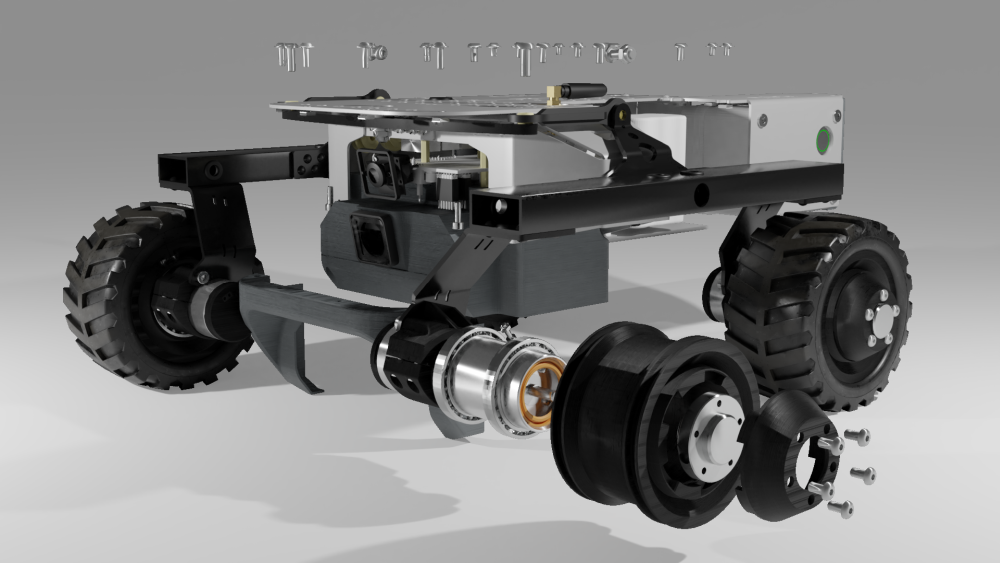

# Welcome to Leo Rover Docs

## Quick links

If you want to check what to do next after you get the Rover:



If you need assembly instructions, begin here:



Need more info about an electronics controller used in the Rover?




If you want to access Turtle Rover docs \(previous version of the Rover\), see:

[https://docs.turtlerover.com](https://docs.turtlerover.com)


