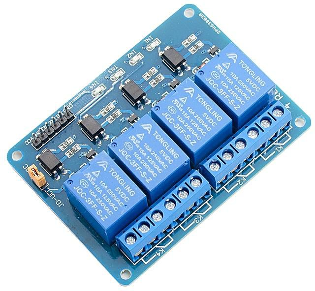
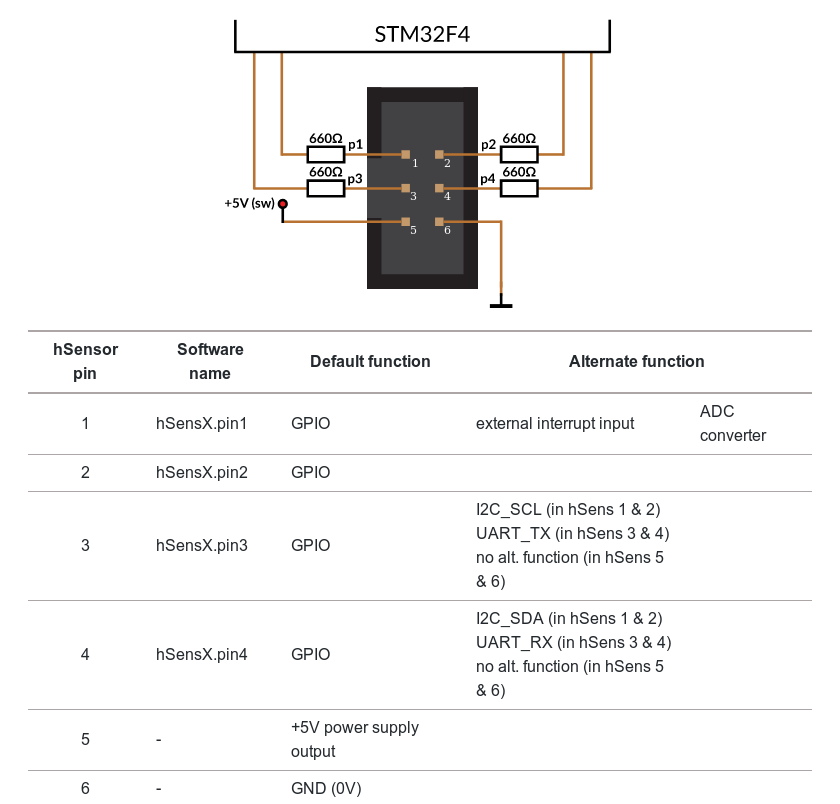
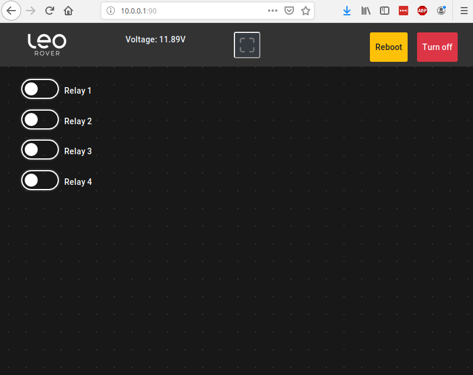

# Relay module

In this tutorial, we will show you how to configure and remotely control relays via additional user's web interface.



## Items needed

* Leo Rover
* 4 channel relay board 
* IDC plug 2x3
* ribbon cable \(6 cores\)
* 3D printed cover

## Prerequisites

Connect to the Rover through SSH



Make sure the Rover is connected to the internet



## 1. Connect the relay board to Core2-ROS

In the tutorial we are using hSens1 port to connect relays to the board.

Connect the relay board to hSens1 port using IDC plug. Pins 1-4 are for signals, 5 is +5V and the last one is GND.






Well done! Hardware is ready


## 2. Flash a dedicated firmware to enable hSense1 port

### 1. Download a dedicated firmware

[https://github.com/szlachcic/leo\_firmware\_relay/releases](https://github.com/szlachcic/leo_firmware_relay/releases)

### 2. Upload the downloaded .hex file to your Rover



### 3. Flash the firmware

Make sure you are in the home directory \(`/home/husarion`\) and type:

```bash
/opt/husarion/tools/rpi-linux/core2-flasher leo_firmware.hex
```

The process of flashing should begin. After it completes, type:

```bash
sudo systemctl restart leo
```

to restart ROS serial node.


### Troubleshooting - if bootloader not flashed

If you have a brand new CORE2 board \(never flashed\), you may need to flash its bootloader for a firmware to work.

Download the bootloader from [here](https://files.husarion.com/bootloader/bootloader_1_0_0_core2.hex) and upload it to your Rover or, if you connected the Rover to the Internet, just type:

```bash
wget https://files.husarion.com/bootloader/bootloader_1_0_0_core2.hex
```

Then, type the following commands:

```bash
/opt/husarion/tools/rpi-linux/core2-flasher --unprotect
/opt/husarion/tools/rpi-linux/core2-flasher bootloader_1_0_0_core2.hex
/opt/husarion/tools/rpi-linux/core2-flasher --protect
```

Now you can get back to the firmware flashing operation.


## 3. Add user web interface to nginx server

#### 1. Clone a repository that contains a relay interface from GitHub

```text
cd /opt
git clone https://github.com/LeoRover/leo_ui_sample_relay.git
```


If you like to learn how this UI is build- check this tutoral: [Sample UI- relay funcionality](sample-ui-relay-funcionality.md)


#### 2. Add a configuration file for nginx server to use the interface on additional port :90

Find a directory /etc/nginx/sites-available and create there leo\_ui\_sample\_relay file by copying it from leo\_ui

```text
cd /etc/nginx/sites-available
sudo cp leo_ui leo_ui_sample_relay
```

Open the created file

```text
sudo nano leo_ui_sample_relay 
```

and make changes in the lines as below

```text
listen 80 default_server;        ==>    listen 90 default_server;
listen [::]:80 default_server;   ==>    listen [::]:90 default_server;

root /opt/leo_ui;                ==>    root /opt/leo_ui_sample_relay;
```


Save the file - type ctrl+o 


#### 3. Restart nginx service

```text
systemctl restart nginx
```

## How to control the relays via user interface

### 1. Connect to the Rover wifi network

### 2. Open web browser and type 10.0.0.1:90



