# \[Archive\] 3D printing

## Printed parts files

[https://drive.google.com/open?id=1fjLZ5CPHxrnR3lw8I2mug7GF09sP5THD](https://drive.google.com/open?id=1fjLZ5CPHxrnR3lw8I2mug7GF09sP5THD)

## Materials and quantities

| ID | Name | Material | Pcs. needed | Est. time |
| :--- | :--- | :--- | :--- | :--- |
| 00158 | MEB Box | Gray PLA | 1 | 11h00min |
| 00158-cover | MEB cover | Gray PLA | 1 | 5h40m \(20% inf.\) |
| 00183 | Wifi adapter | Black PET / Any | 1 | 0h28m |
| 00182 | Converter adapter | Gray PLA / Any | 1 | 1h00min |
| 00098 | Front cover | Gray PLA | 1 |  |
| 00099 | Battery cover | Gray PLA | 1 |  |
| 00130 | Add. quarter cover | Gray PLA | 1 |  |
| 04003e | Wheel cap | Black PET | 4 | 4x = 2h25min |
| 00173 | Torque plate | Black PET | 4 | 2x = 1h38min |
| 00129 | Wheel rim | Black PET | 4 | 2x = 14h00min |
| 00175 | Wheel upper mount | Black PET | 4 |  |
| 00177 | Wheel lower mount | Black PET | 4 |  |
| 00155 | Beadlock A | Black PLA | 4 |  |
| 00155b | Beadlock B | Black PLA | 4 |  |
| 00025 | Motor mount | Black PET | 4 | 12x = 3h48min |
| 00180 | Shaft adapter tool | Any | 1 | 1x = 0h16min |

## Parts gallery

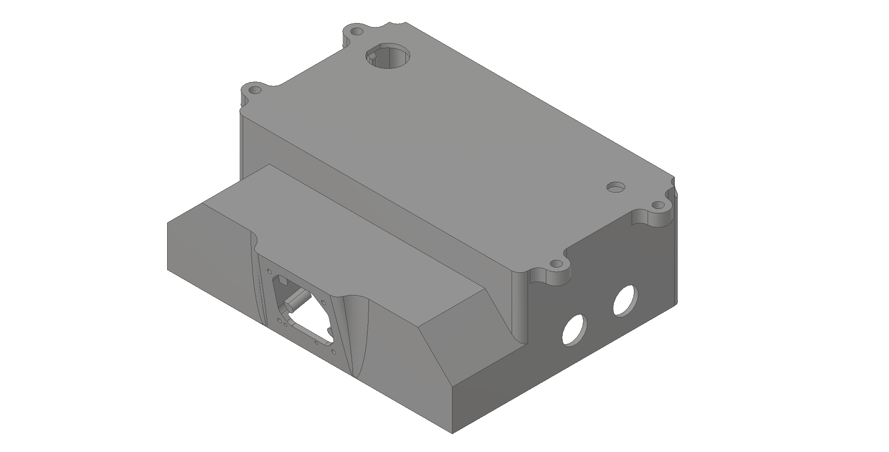

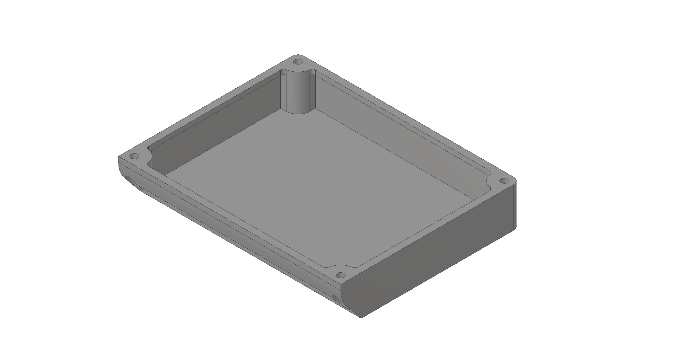

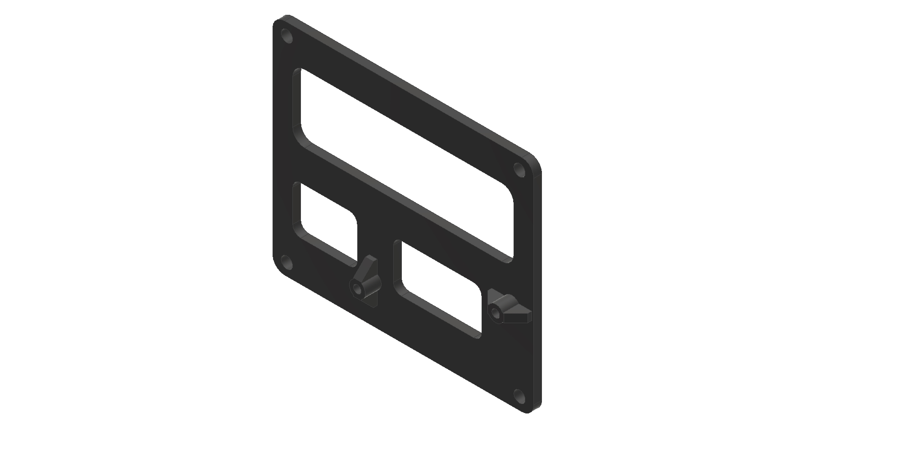

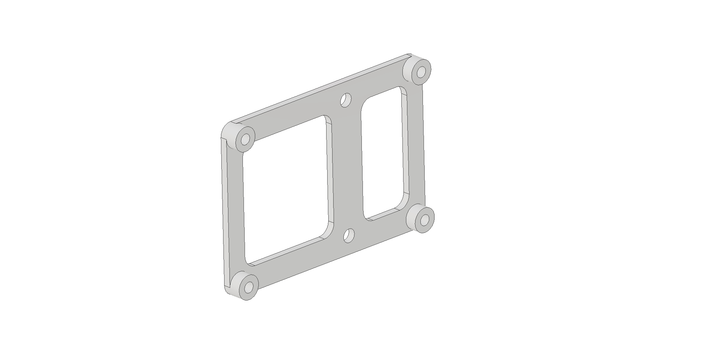

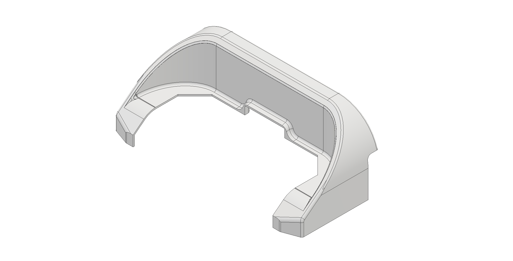

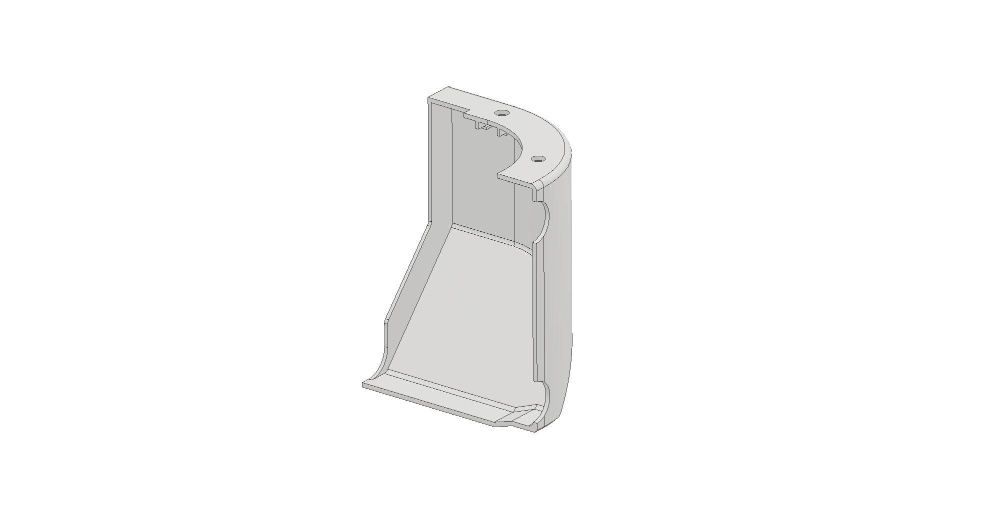

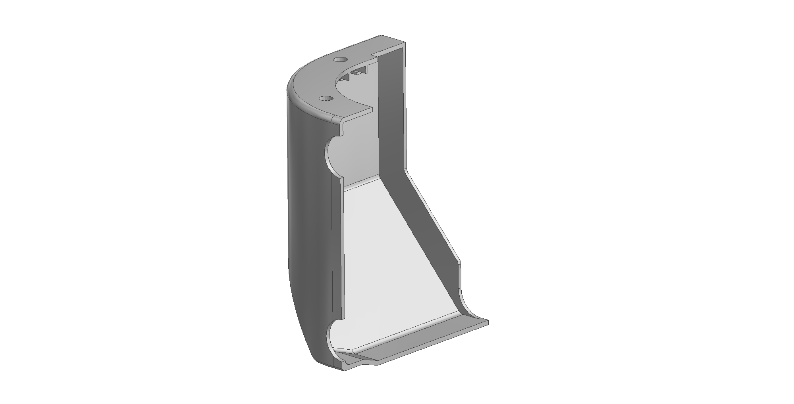

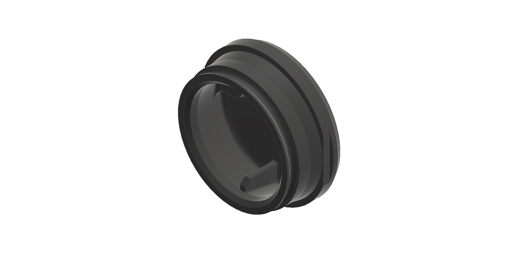

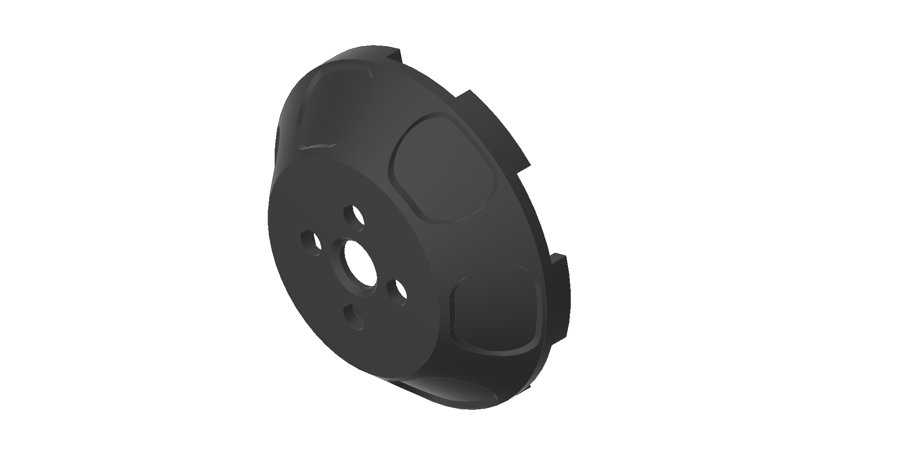

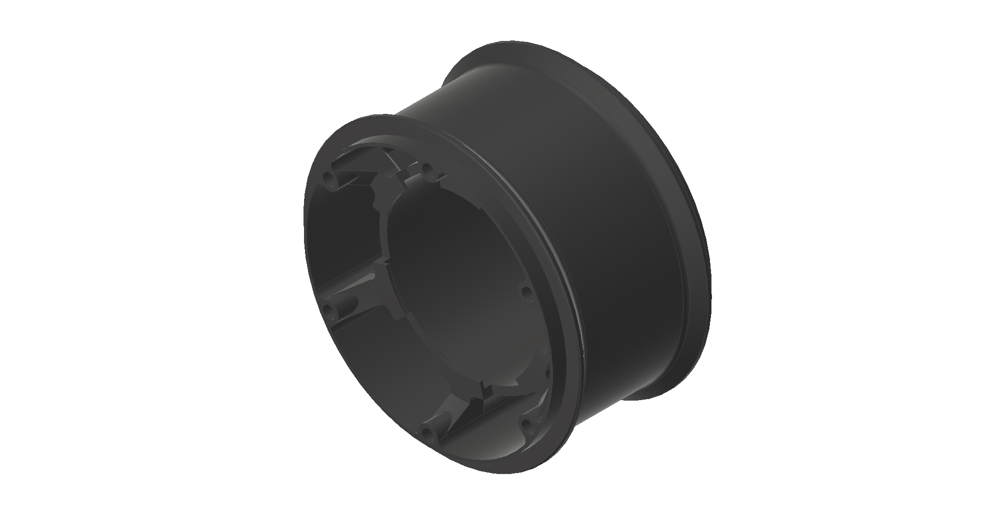

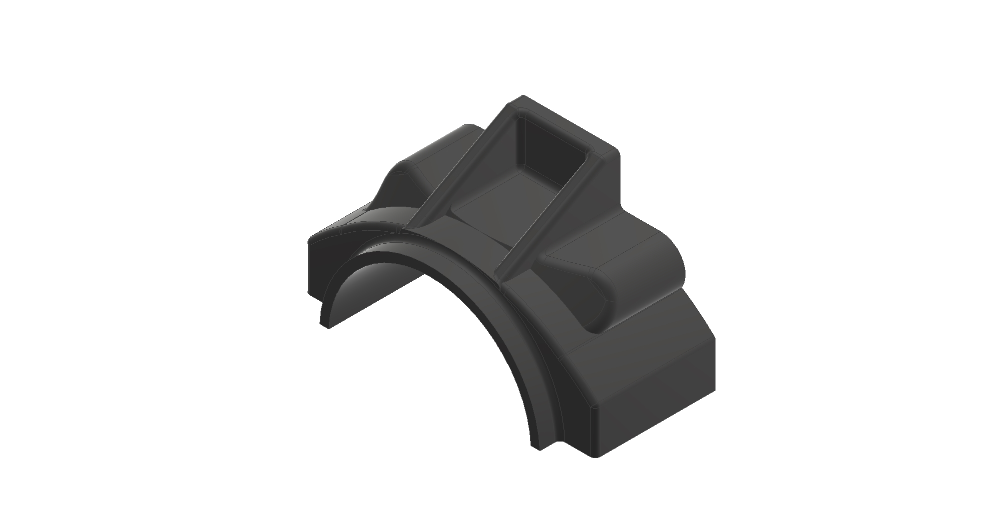

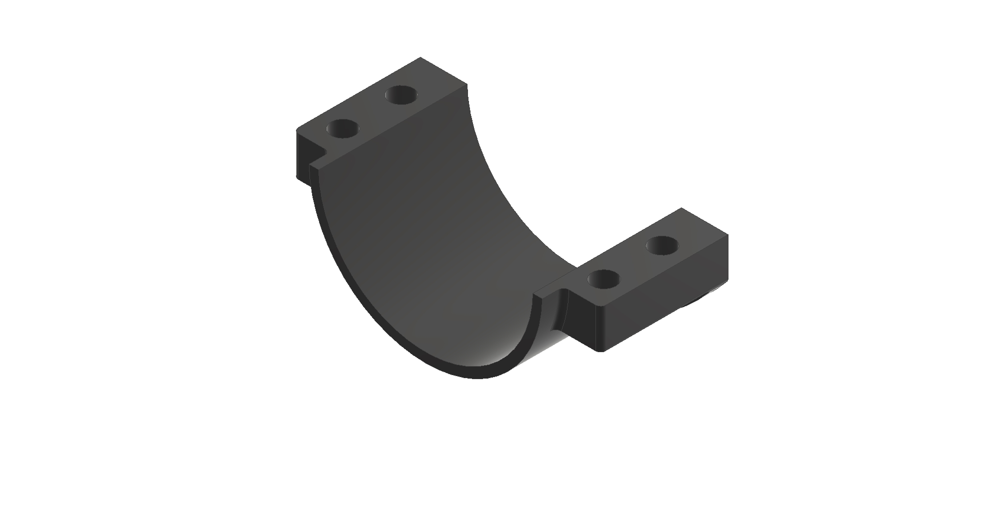

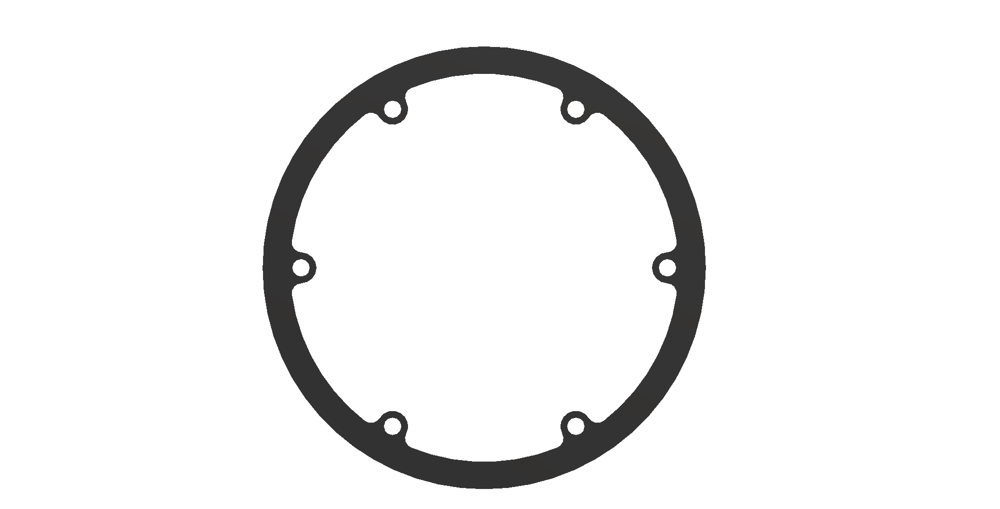

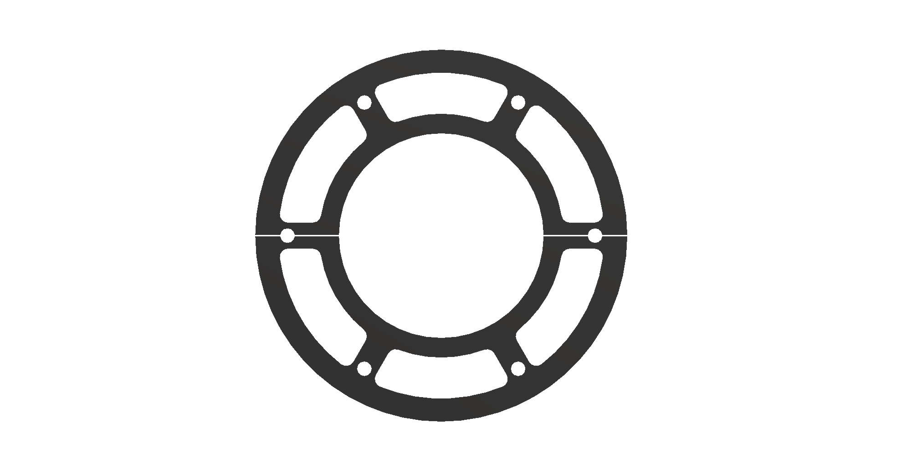

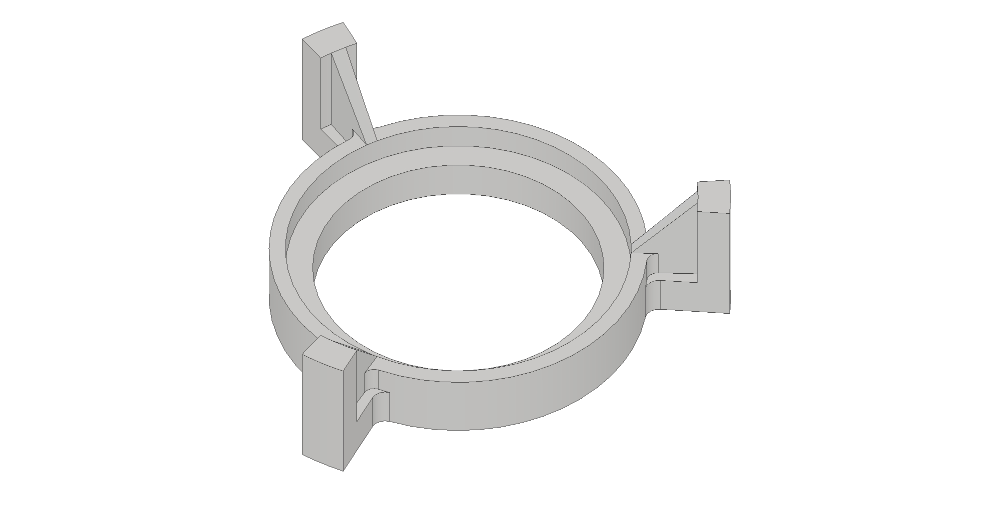

## Threaded inserts 1.0.1

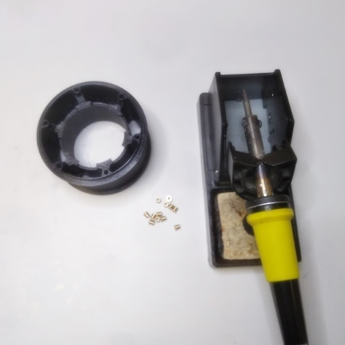

To heat-press the inserts you'll need a cheapest soldering iron that most probably won't be used for real soldering anymore - it's messy.

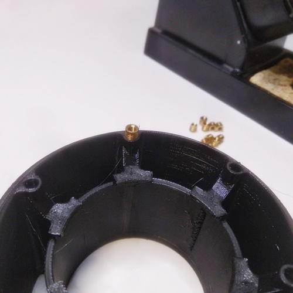

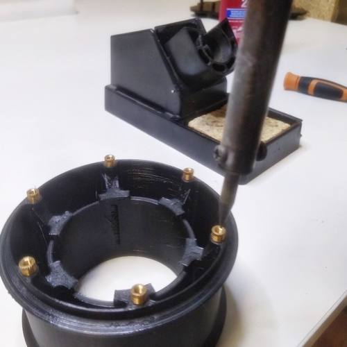

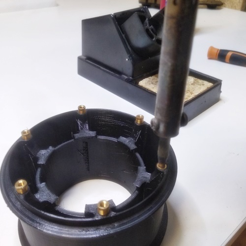

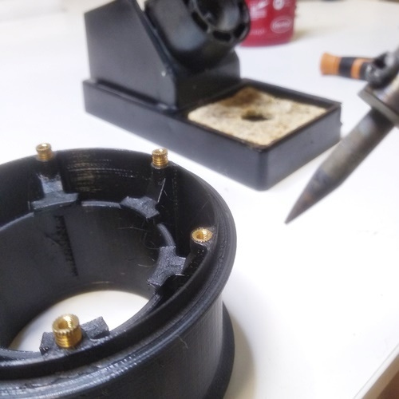

You'll have to press 12x M3 inserts in each of the wheel rims \(00129\), 4x m4 and 2x m5 inserts in Wheel Upper Mount \(00175\) and 4x M4 and 4x M3 in MEB Box \(00158\).

