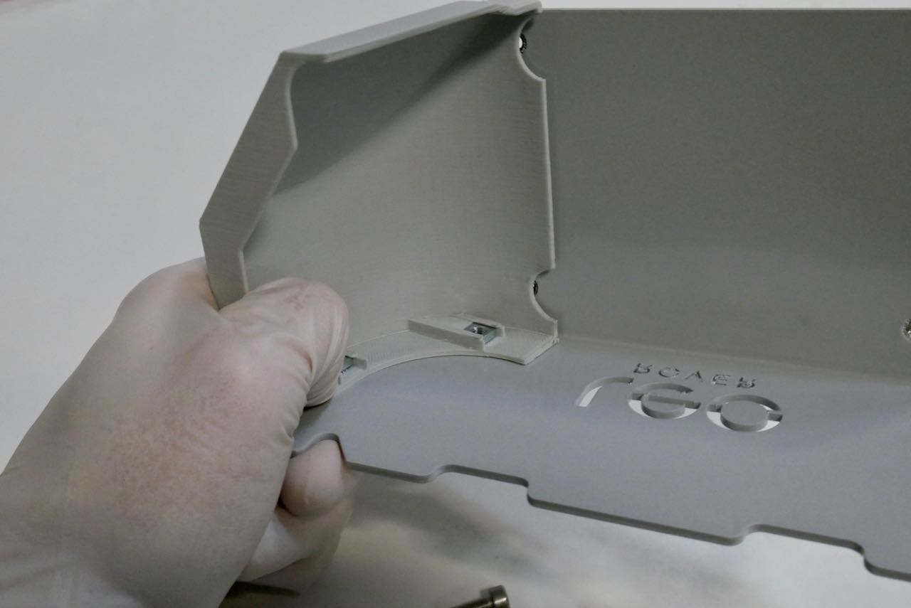
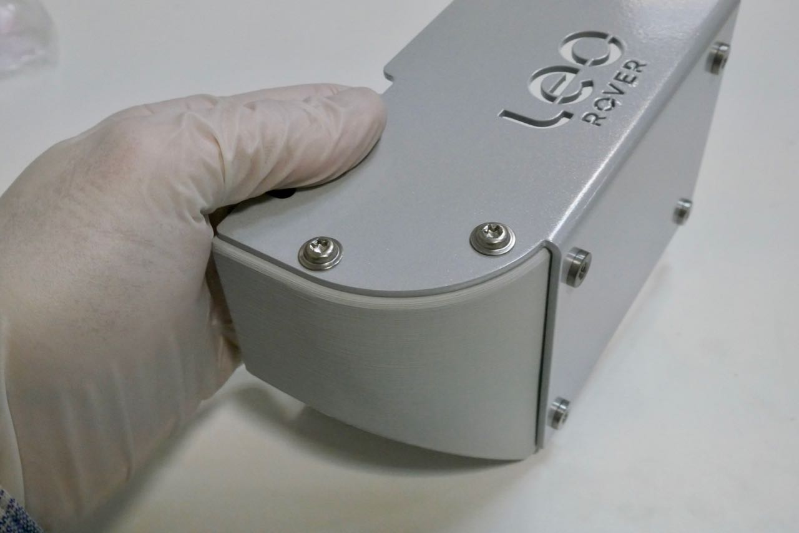
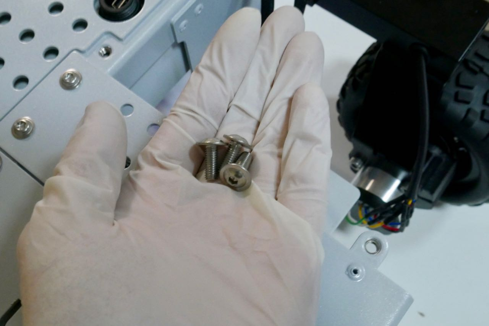
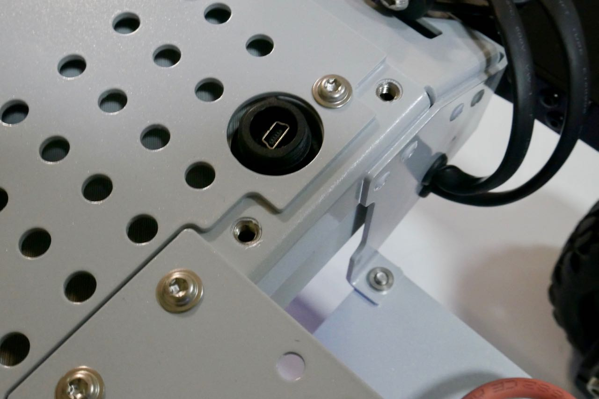
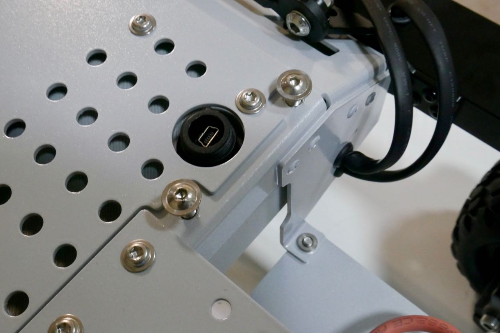
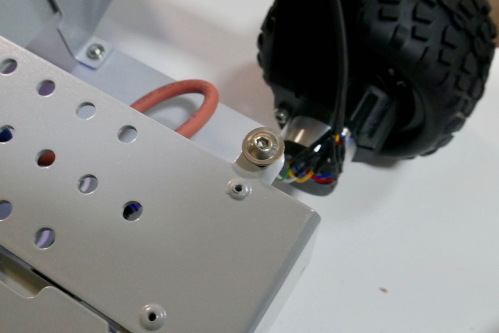
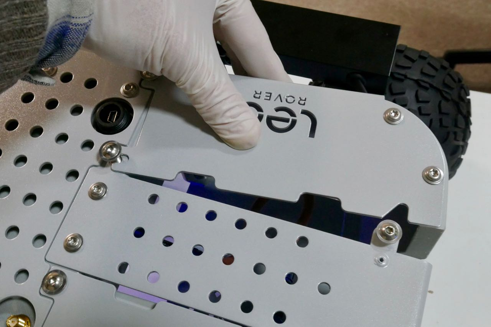
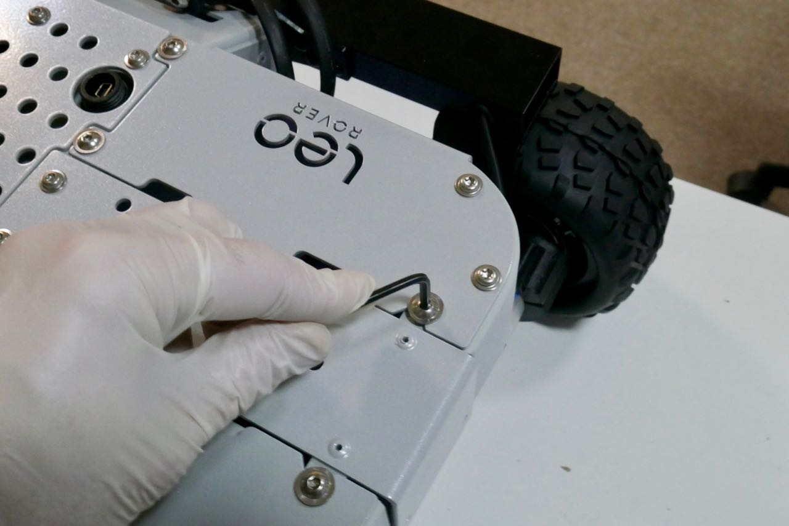
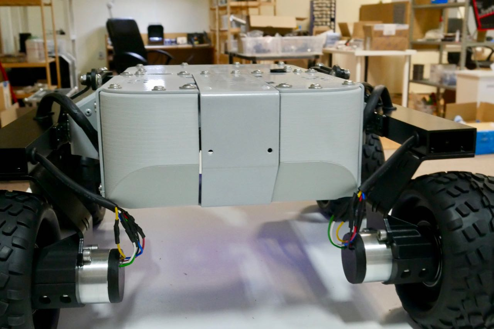

# Task 7: Additional quarter \(right\) assembly

## Intro

### Assembly time

5 minutes

### Tools needed

* [ ] T5x40 torx screwdriver \(provided\)
* [ ] no. 3 hex-head key \(metric; provided\)

## Assembly guide

## Connect the quarter to the Rover

