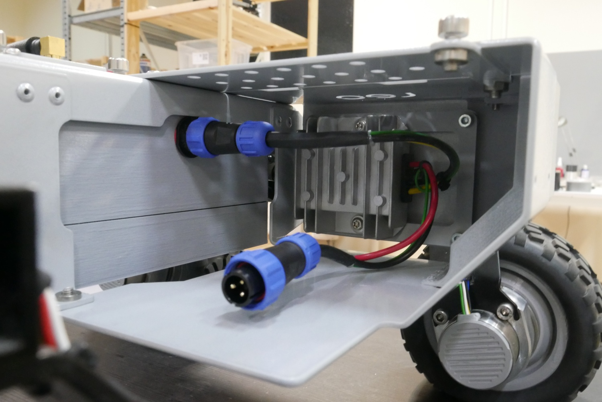

# 6. Additional quarter \(right\) assembly

Currently the additional quarter is used to hold 24V-12V DC converter used to run 24V batteries with 12V internal electronics.

This way, depending on where you connect, you can use 12V and 24V power supply for your own projects.

## Assembly guide

Sorry, no detailed description yet. But we have a photo! :\)

## Power limits

| Voltage | Current |
| :--- | :--- |
| 12V DC | max. 10A |
| 24V DC | max. 8A |

