# Main Electronics Box assembly

## MEB assembly guide

There's not enough photos here, but we're working on it. Here are some bullet points though:

1. Unpack a front camera shield \(glass\) provided and assemble it to the front of MEB.
2. Use short cross-headed screwdriver or simply put your screwdriver through a rear hole to have enough space to tighten the 4x shield screws.
3. Unpack a camera provided and disconnect its tape \(comes connected to the camera\).
4. Assemble the camera using 2x 2,2x6,5 self-tapping screws provided \(use short screwdriver or do the same as in 2.\).
5. Unpack an antenna connector and miniUSB sealed connector and guide them through the mating holes in MEB floor \(or ceiling, depends on the perspective\). Secure them in place.
6. Unpack and secure rear power connector \(3pin with green cable; white dot should point the case floor\).
7. Open Core2ROS box \(the one colored white-red as true Polish patriotic product\) and unscrew it from the plastic stand \(save the screws; let's name them A1\). Unscrew the free distances as well \(let's name them A2\).
8. Open RaspberryPi box \(you'll know which one\) and tighten the distances to the Pi.
9. Connect the camera tape to RaspberryPi camera port and bend the tape so it goes sideways \(the side with no goldpins\).
10. Unpack Wifi USB modem from a separate bag and use 4x plastic m2,5x18 distances to attach RaspberryPi to Core2ROS hat.
11. Use 2x self-tapping screws to attach the modem to its 3d-printed \(00183\) mounting adapter \(modem lays on the flat side\).
12. Assemble the adapter using A2 screws to Core2ROS. Plug USB connector to the Raspberry.
13. Plug microSD extending tape to the Raspberry.
14. Plug a USB connector of miniUSB sealed interface \(from the case\) to the RasperryPi.
15. Put the Core2ROS + RaspberryPi assembly on the case distances and secure it using A1 screws. It will be tight, so do your best to squeeze it right.
16. Connect the power connector to Core2 and plug its green connector to Core2 6th servo interface \(3pin, closes to the edge\).
17. Connect the camera tape to the camera.
18. Connect the antenna to the modem and secure it with a ziptie \(it tends to disconnect if you do it wrong\).
19. Do Wheel Cable Connection 4 times \(sorry for photos out of order\).
20. Connect the Wheel pins to Core2ROS: red is OutA; black OutB; etc.
21. Squeeze the microSD extender tape as much as you can in the assembly.
22. Add the microSD card with Leo Software image.
23. Put a cover seal in the box groove - the loose ends should overlap each other.
24. Tighten the cover using proper m4x12 screws.
25. And ... woila! Done.

## Wheel Cable Connection

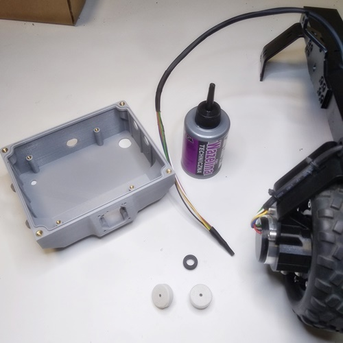

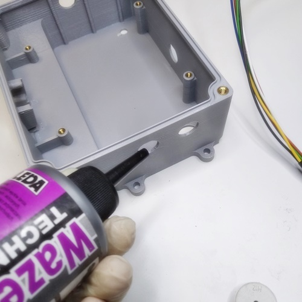

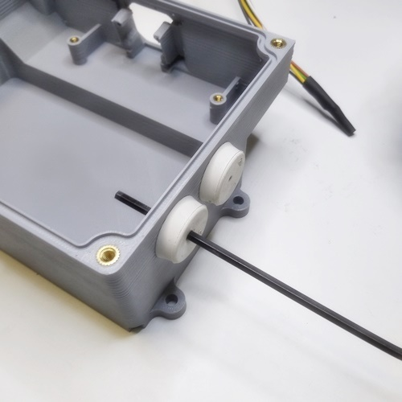

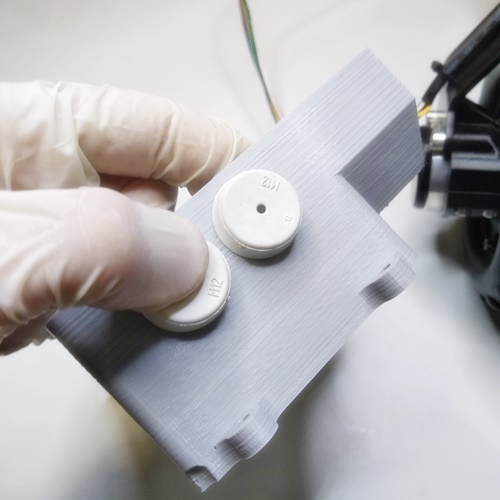

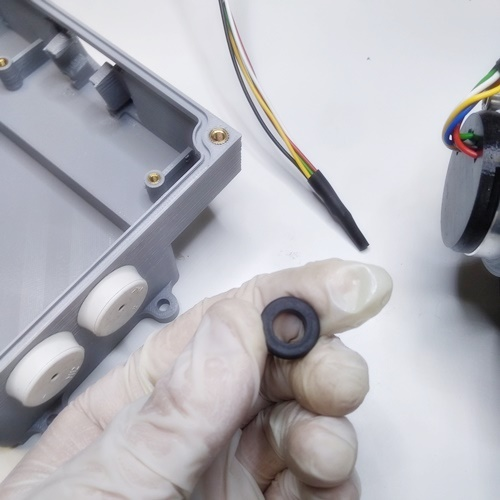

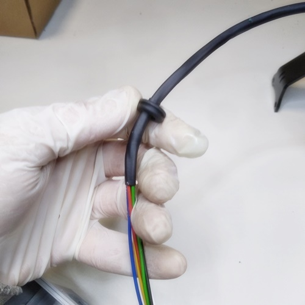

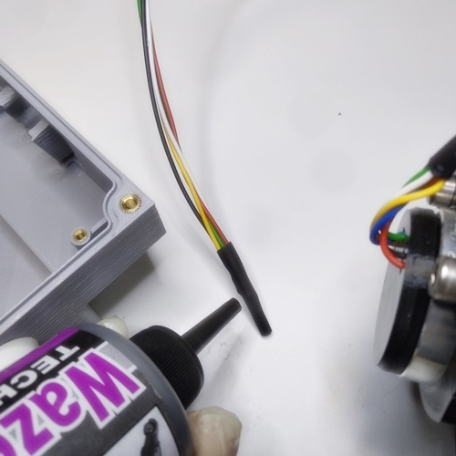

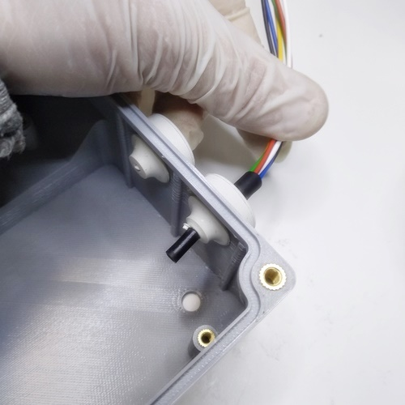

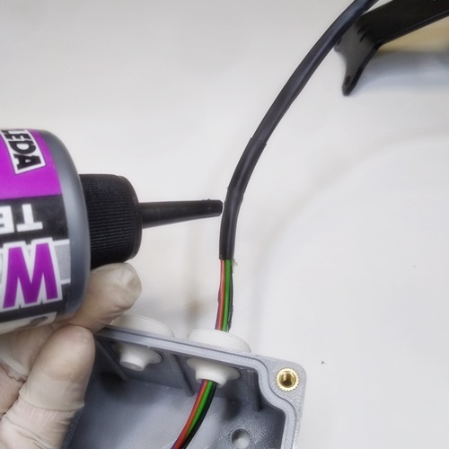

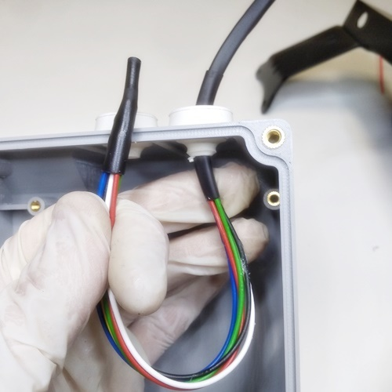

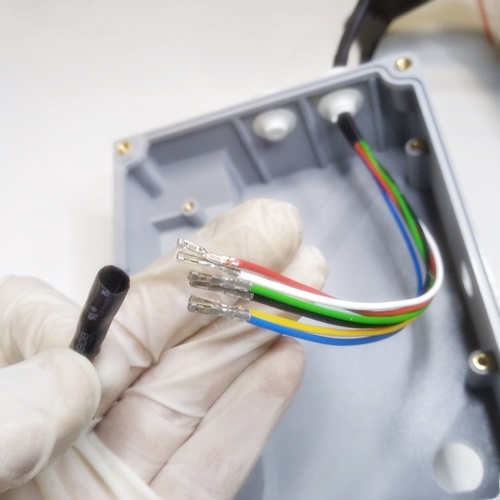

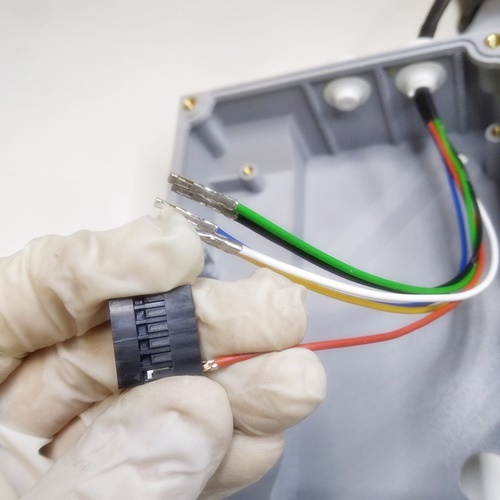

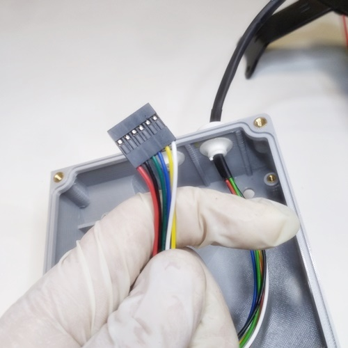

