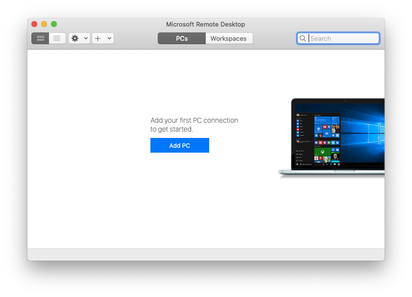
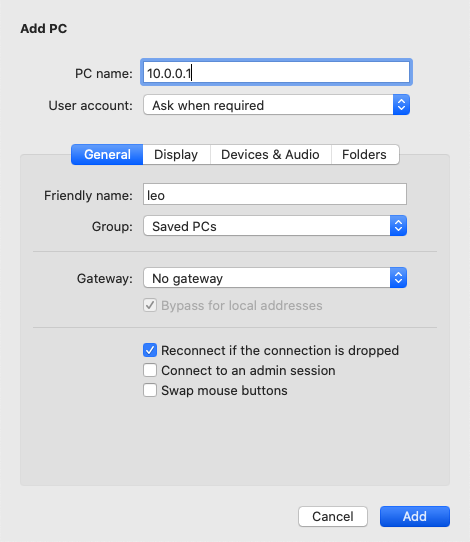
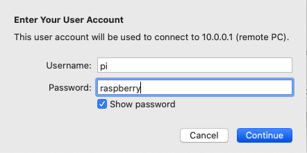
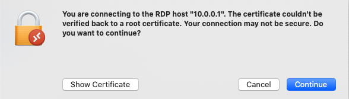

# Connect via remote desktop

If you are using the `full` version of LeoOS, you should have a desktop environment installed, as well as an RDP \(Microsoft Remote Desktop Protocol\) server. This allows you to remotely control a desktop session on your Rover from your computer.

## On Windows

Click **Start**, type `remote` and choose **Remote Desktop Connection** app. 

Type `10.0.0.1` in the **Computer** field and click **Connect**.

You should see a similar warning. Click **Yes** to proceed.

You should see the login screen. Choose `Xorg` session, type `pi` for the username, `raspberry` for the password and click **OK**.

## On Linux

Install and open [Remmina Remote Desktop Client](https://remmina.org/how-to-install-remmina/).

Click on the `+` icon and fill the following fields:

* Server: `10.0.0.1` 
* User name: `pi` 
* User password: `raspberry` 
* Color depth: `True color (32 bpp)` 
* \(Optional\) Name - if you want to save the settings
* \(Optional\) Resolution - If you want to use a custom resolution

Click on **Save and Connect**.

If you get a prompt about the certificate, click **OK**.

## On macOS

Install and open [Microsoft Remote Desktop](https://apps.apple.com/pl/app/microsoft-remote-desktop/id1295203466?l=pl&mt=12).

Click on **Add PC**, type `10.0.0.1` in the **PC name** field, `leo` in the **Friendly name** field and click on **Add**.

Double click on the `leo` computer to connect.

When asked, fill in the Username and Password.

If you get a prompt about the certificate, click **Continue**.

