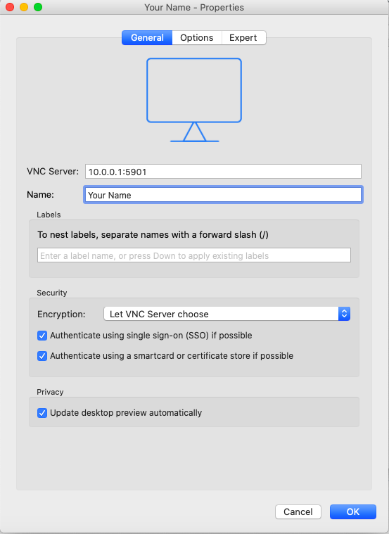
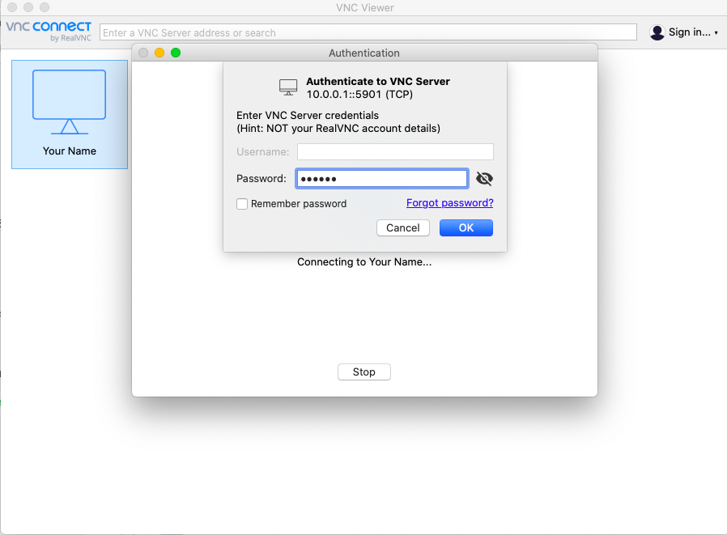
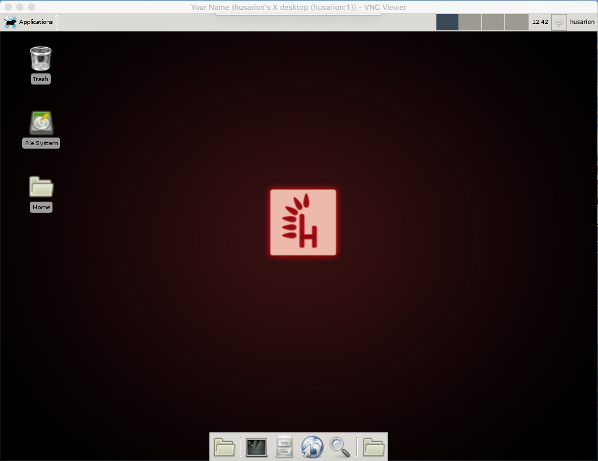

# Connect via remote desktop

As the Rover runs on Ubuntu with GUI you are able to access the internal desktop using VNC server and client from your PC/Mac. You can use that to make it easier to work on files, run ROS GUI apps and even run [Minetest \(free Minecraft\)](http://www.minetest.net/downloads/).

## Set a VNC server on the Rover

### 1. Connect to the Internet



### 2. Connect to the console



### 3. Install and run VNC server

We'll use Tight VNC Server. Type in the console:

```text
sudo apt install tightvncserver
```

And after installation is complete. Type to run the server:

```text
tightvncserver
```

You'll need to set a password for the connection. Use anything between 6-8 characters.

```text
You will require a password to access your desktops.

Password:
Verify:
```

Done!

## Access the desktop from your device

There are several ways to do that, but we'll describe the most universal one here - with VNC Viewer.

### Install VNC Viewer on your device \(Windows/ macOS/ Linux/etc.\)



### **Add New Connection**

**By default the Rover will have the server set on port :5901**

**Type in the VNC Server setting:**

```text
10.0.0.1:5901
```



And press OK.

### Connect to the server

Open the newly added connection and enter the password you set previously in the Rover terminal. Press OK.



### Welcome inside

Here's what you will see when connected. 



Remember to change the desktop to something more suitable for Leo fanbase. [Like this one.](https://drive.google.com/open?id=1iX9Bf2PuQw7AZQgTGgEsxVQ1M2Eie6ZH)


Have fun!


