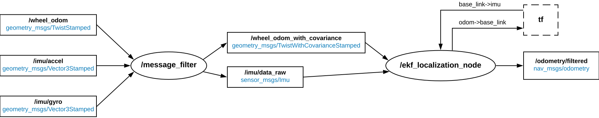
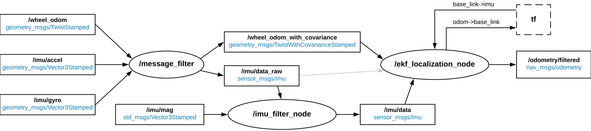
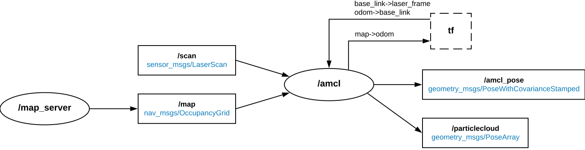
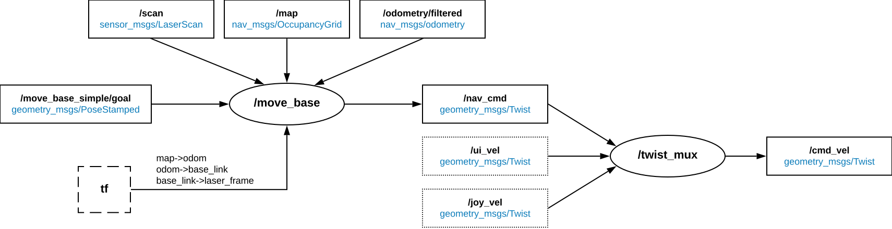

# Autonomous Navigation

In this tutorial, we will show you how to perform SLAM \(Simultaneous localization and mapping\) and autonomous navigation on Leo Rover equipped with IMU and LiDAR sensors.

For this purpose, we prepared the [leo\_navigation](https://github.com/LeoRover/leo_navigation) package which makes use of many other packages available in ROS to provide autonomous capabilities. You won't have to write a single line of code, but some configuration may need to be tweaked to work best in your environment.

## Prerequisites

To complete this guide, you will need to, first of all, have the IMU and LiDAR sensors integrated with the system:





Make sure you are operating on the newest image for the Raspberry Pi and you are up-to-date with the packages:



A recent version of firmware for the CORE2 board may also be required:



You will also need to have ROS installed on your computer:



Some previous experience with ROS is also recommended. If you are not familiar with it, be sure to check out our ROS Development guide:



## Preparing the environment

There are a few things you will need to prepare on the rover and on your computer, in order to use the software for autonomous navigation.

### On the Rover

You will need to build the `leo_navigation` package first. To do this, start by accessing a remote terminal session on the Rover by logging via ssh:



Create a catkin workspace:

```text
mkdir -p ~/ros_ws/src
cd ~/ros_ws
catkin config --extend /opt/ros/melodic
```

Clone the `leo_navigation` package to the source space:

```text
cd ~/ros_ws/src
git clone https://github.com/LeoRover/leo_navigation
```

Use `rosdep` to install dependencies:

```text
cd ~/ros_ws
rosdep update
rosdep install --from-paths src -iy
```

Build the workspace:

```text
catkin build
```

Source the devel space:

```text
source ~/ros_ws/devel/setup.bash
```


You will have to source the devel space on every terminal session you want to use the package on. If you want to do it automatically upon logging into a session, add the above line to the `~/.bashrc` file. 


#### Checking the sensors

It is also advisable to check whether the sensors are correctly integrated into the system. Make sure the sensor-related data is published on the correct topics:

```text
rostopic echo /imu/gyro
rostopic echo /imu/accel
rostopic echo /imu/mag
rostopic echo /scan
```

You will also need to have the transforms, from `base_link` to frame ids associated with the sensor messages, available in the tf tree.

```text
rosrun tf tf_echo /base_link /imu
rosrun tf tf_echo /base_link /laser_frame
```

If you see errors, it probably means you omitted the part about extending the URDF model when integrating the sensor.

### On your computer

In this guide, your computer will be used for visualizing the data processed on the rover and sending navigation goals. For this purpose, you will need to install the [leo\_description](https://github.com/LeoRover/leo_description) package, which contains the robot model and the [leo\_viz](https://github.com/LeoRover/leo_viz) package which contains configuration files for RViz.

You can build them using the instructions from [this chapter](https://docs.leorover.tech/development-tutorials/ros-development#building-additional-ros-packages). You can also download the prebuilt packages from the ROS repository by executing:

```bash
sudo apt install ros-<distribution>-leo-viz
```


Replace `<distribution>` with the ROS distribution you have installed on your computer \(either `kinetic` or `melodic`\). 


You will also need to properly configure your computer to communicate in the ROS network, so be sure you have correctly set these environment variables:

```text
export ROS_IP=<your ip>
export ROS_MASTER_URI=http://10.0.0.1:11311
```

For more information, visit **ROS Development** -&gt; **Connecting other computer to ROS network**

## Launching the software

Now that everything is ready, we can proceed to launching some software.  
This whole section will describe in detail the functionalities provided in the `leo_navigation` package and how to use them.

Here's a brief summary of different parts of the navigation software we will run:

* **Odometry** – It is necessary for any autonomous navigation system to be able to estimate its position. For this reason, we will use wheel encoders and IMU readings to track the change in position over time.
* **SLAM** – Once we are able estimate the robot's position, we will use it, together with the LiDAR sensor measurements, to produce an occupancy map of the terrain. While doing so, we will also correct the estimated position based on the loop closure detection. After the whole terrain is mapped, we will save the map to a file and later use it to track robot's pose against it.
* **Navigation** – With an occupancy map and an accurate enough pose estimation, we can finally try to perform some autonomous navigation. When a new navigation goal is set, a path planning algorithm will find a collision-free path to it. Another algorithm will then send velocity commands to the rover to try to follow that path while also being aware of the obstacles.

All of the functions are provided through launch files that are located under the **launch/** directory. All parameters for the running nodes are loaded from YAML files located under the **config/** directory.

### Odometry

To estimate robot's position from wheel encoders and IMU, we will use the [robot\_localization](http://docs.ros.org/melodic/api/robot_localization/html/index.html) package which contains two state estimation nodes: the `ekf_localization_node` which implements [Extended Kalman Filter](https://en.wikipedia.org/wiki/Extended_Kalman_filter) algorithm and the `ukf_localization_node` which implements [Unscented Kalman Filter](https://en.wikipedia.org/wiki/Kalman_filter#Unscented_Kalman_filter). We will use the first option as it is less computationally expensive but the latter is a more stable alternative.

Without further ado, let's try to run the localization software and see the result. Later, we will explain what is actually going on.

On the rover, type:

```bash
roslaunch leo_navigation odometry.launch
```

On your computer, type:

```bash
roslaunch leo_viz rviz.launch config:=odometry
```

The RViz instance should start and you should see the robot model. Now, try to steer the rover \(either from the Web UI or by using a joystick\). If everything works, you should see the model moving along the ground plane like in this video:



Here's a diagram that illustrates the nodes launched by the `odometry.launch` file and the connections between them:




The ovals represents the nodes. The rectangles with solid lines represent the topics.  The blue text inside the rectangles indicate the type of messages published on the topic. The arrows between the ovals and rectangles represent the topic Subscribers and Publishers. **tf** rectangle represents the transforms between coordinate frames exchanged through the [tf2 library](http://wiki.ros.org/tf2). 


The state estimation node requires that the input topics are stamped messages which contain covariance matrices. That's why the `leo_navigation` package provides the `message_filter` node which:

* for each message on `/wheel_odom` topic, publishes a message on the `/wheel_odom_with_covariance` topic which contains the same data but with an added covariance matrix,
* for each pair of `/imu/accel` and `/imu/gyro` messages, publishes a message on `/imu/data_raw` topic which combines the two messages and adds covariance matrices.

Apart from these topics, the `ekf_localization_node` listens for the `base_link->imu` tf transform to transform IMU readings to a common reference frame \(`base_link` in this case\).

The current state estimation is published on the `/odometry/filtered` topic and the pose is also broadcasted as the `odom->base_link` transform. That's why, having the **Fixed Frame** set to `odom`in RViz, you can see the model moving.

#### 3D odometry

Notice that we didn't use much from the measurements returned by the IMU sensor, except for the angular velocity which was used to correct the wheel odometry.

Thanks to the [imu\_filter\_madgwick](http://wiki.ros.org/imu_filter_madgwick) package, we can get pretty good orientation estimate, which, combined with the wheel odometry, can be used to track the robot's position in 3D. The package uses the [Madgwick's filter](https://x-io.co.uk/open-source-imu-and-ahrs-algorithms/) to fuse data from a gyroscope, an accelerometer and \(optionally\) a magnetometer.

To try the robot's state estimation in 3D, start the same launch file as in the previous example, but with the `three_d` argument set to `true`: 

```bash
roslaunch leo_navigation odometry.launch three_d:=true
```

Now try to steer the rover on uneven terrain and observe the result in RViz.

The diagram for the `odometry.launch` file now changes a little:



We now have the `/imu_filter_node` which takes messages from the `/imu/data_raw` topic \(gyroscope and accelerometer data\), calculates the orientation of the sensor and publishes the data with added orientation quaternion on the `/imu/data` topic. The node can also optionally incorporate the `/imu/mag` topic \(magnetometer data\).

The `/ekf_localization_node` now uses different configuration which takes the data from `/imu/data` topic and uses the orientation quaternion in the state estimation.

#### Configuration

For the `/message_filter` node, there is the **config/message\_filter.yaml** file in which you can change the values on the diagonals of the covariance matrices, which represent the variances \(the uncertainty\) of the measurements.


It might be better to leave the values as they are if you have no idea what they mean.


The configuration files for the `/ekf_localization_node` can be found in the **config/ekf\_localization\_node/** directory. There are two files: **ekf\_2d.yaml** and **ekf\_3d.yaml**. The appropriate file is chosen depending on the value of `3d` argument passed to the launch file.

A full description of parameters for the state estimation node can be found on the [robot\_localization documentation](http://docs.ros.org/melodic/api/robot_localization/html/state_estimation_nodes.html) and in the [ekf config template](https://github.com/cra-ros-pkg/robot_localization/blob/kinetic-devel/params/ekf_template.yaml).

There is also the **config/imu\_filter\_node.yaml** file for the Madgwick's filter. The parameters are explained in the [imu\_filter\_madgwick Wiki page](http://wiki.ros.org/imu_filter_madgwick). If you want to use the magnetometer data, just change `use_mag` parameter to `true`. 


It is essential to have the magnetometer properly calibrated for the measured data to be useful. Magnetometers are prone to distortion, so even a slight change of the environment can make the current calibration invalid. 


If you set the `use_mag` parameter and want use the heading information \(compass\) in `/ekf_localization_node` , just modify the `imu0_config` parameter so that the yaw value is fused into the state estimate:


```yaml
imu0_config: [false, false, false,
              true,  true,  true,
              false, false, false,
              true,  true,  true,
              true,  false, false]
```


### SLAM

SLAM \(Simultaneous Localization and Mapping\) is a problem of constructing a map of the environment while simultaneously keeping track of the robot within it. It is hard because a map is needed for localization and a good pose estimate is needed for mapping, so this appears to be chicken-and-egg problem. There are, however, methods of solving it approximately with the use of probabilistic algorithms, such as the [particle filter](https://en.wikipedia.org/wiki/Particle_filter).

One such approach, called [GMapping](https://openslam-org.github.io/gmapping.html), can be used to perform SLAM with the laser range data \(LiDAR scans\) and a local odometry source. The algorithm has its ROS wrapper node in the [gmapping](http://wiki.ros.org/gmapping) package. To run it, just type:

```yaml
roslaunch leo_navigation gmapping.launch
```


Mark the start position of the rover! It will be useful later.


On your computer, close any running RViz instance and open a new one with the `slam` configuration: 

```yaml
roslaunch leo_viz rviz.launch config:=slam
```

Now try to explore the terrain with your rover and see the map being created. You will probably experience the model doing discrete jumps on the map from time to time. This is due to gmapping correcting robot's position within the map. Here's a video demonstration:



The diagram for the `gmapping.launch` file is pretty straightforward:


The `/slam_gmapping` node takes as the input:

* laser scan data from the LiDAR sensor \(`/scan` topic\),
* position of the laser reference frame \(`base_link->laser_frame` transform\),
* current position of the robot from the odometry \(`odom->base_link` transform\).

As the output, it returns:

* an occupancy grid map of the terrain \(`/map` and `/map_metadata` topics\),
* current odometry drift based on the estimated position of the robot within the map  \(`map->odom` transform\).


The `map`, `odom` and `base_link` are coordinate frame names commonly used in mobile platforms. To learn about their semantic meaning, you can read [REP105](https://www.ros.org/reps/rep-0105.html#id8).

When the `/slam_gmapping` node tries to correct robot's position within the map, it does not broadcast the position as the `map->base_link` transform, because that would make 2 root coordinate frames \(`map` and `odom`\). Instead, it provides the `map->odom` transform which marks the difference between the odometry position and the actual position of the robot within the map \(the odometry drift\). 


#### AMCL

If you already explored all the terrain you wanted to map, the `/gmapping` node can draw unnecessary resources for its mapping part. When map is no longer updated, it is more efficient to just use an algorithm that will only track robot's position against the map you have generated.

That's where the [amcl](http://wiki.ros.org/amcl) package comes in handy. It implements the [Monte Carlo localization](https://en.wikipedia.org/wiki/Monte_Carlo_localization) algorithm for laser range data. To use it, first, save the current map generated by GMapping using the `map_saver` script:

```yaml
rosrun map_server map_saver -f mymap
```

This will create 2 files: **mymap.yaml** containing map's metadata and **mymap.pgm** containing the actual occupancy grid in binary format.

Close the `gmapping.launch` instance by clicking **Ctrl+C** on the terminal session it is running on. Then start `amcl.launch` by typing:

```yaml
roslaunch leo_navigation amcl.launch map_file:=<path_to_the_map_file>
```

Replace `<path_to_the_map_file>` with the absolute path to the **mymap.yaml** file. If the file is in your current working directory, you can instead type:

```yaml
roslaunch leo_navigation amcl.launch map_file:=$(realpath mymap.yaml)
```

If your initial pose is far from the real one, AMCL might not be able to correctly localize the robot on the map. To fix this, you can use the **2D Pose Estimate** tool in RViz to manually set the initial pose.

When your initial pose is close enough to the real one, try to steer the robot and notice how the position of the robot model in RViz is being corrected by AMCL.





Similar to the `/slam_gmapping` node, `/amcl` takes the laser range data \(`/scan` topic\) as input and provides the odometry drift information by broadcasting the `map->odom` transform. The difference is that instead of publishing to the `/map` topic, it receives the \(previously generated\) map from the `/map_server` node.

You can also notice 2 additional topics published by the `/amcl` node:

* `/amcl_pose` − estimated pose of the robot within a map, with covariance,
* `/particlecloud` − a set of pose estimates being maintained by the Monte Carlo localization algorithm.

You can visualize the data published on these topics by enabling the `AMCL Pose` and/or the `AMCL Particle Cloud` displays in RViz.

#### Configuration

The configuration for the `/slam_gmapping` node is loaded from the **config/slam\_gmapping.yaml** file. For description of each parameter, visit the [gmapping ROS wiki page](http://wiki.ros.org/gmapping#Parameters).

Here are some parameters you can try to adjust:

* `map_update_interval` − control how often to update the map. 
* `linearUpdate`, `angularUpdate`, `temporalUpdate` − control when to process new laser scans.
* `particles` − increasing this number may improve the quality of the map at the cost of greater computational load.
* `minimumScore` − you can experiment with this parameter if you are experiencing jumping pose estimates in large open spaces.
* `maxUrange`, `maxRange` − try to set these parameters like this:  `maxUrange` &lt; maximum range of your LiDAR sensor &lt;= `maxRange`.
* `delta` − increasing this will lower the resolution of the map but may improve performance.

Similarly, for the `/amcl` node, there is the **config/amcl.yaml** file with the parameters that are described in the [amcl ROS wiki page](http://wiki.ros.org/amcl#Parameters).

Here are some parameters worth to notice:

* `min_particles`, `max_particles` − higher number of particles may increase the accuracy of the estimates at the cost of computational load.
* `update_min_d`,`update_min_a` − control when to perform filter updates.
* `initial_pose_x`, `initial_pose_y`, `initial_pose_a` − initial mean pose used to initialize the filter.
* `laser_max_beams` − you can experiment with this parameter. Higher number may increase the accuracy at the cost of computational load.


Changing the parameters in a way that results in higher computational load may lead to violation of the real-time constraint. This in turn can make the algorithms perform even worse.


### Navigation

Now that you have the map of the terrain and your rover can localize itself within it \(with either gmapping or amcl\), you can try to make the robot drive autonomously to the designated position on the map. 

To do this, we will utilize 2 packages:

* [move\_base](http://wiki.ros.org/move_base) − provides a node which, given a navigation goal, will try to reach it by sending appropriate velocity commands. It incorporates many other components that have their own ROS API to achieve autonomous navigation capabilities. 
* [twist\_mux](http://wiki.ros.org/twist_mux) − provides a node which will let us multiplex several velocity commands, prioritizing one over the other. This will allow us to take control of the robot with a joystick or the Web UI if the navigation goes out of control.

To start these two nodes on you rover, just type:

```yaml
roslaunch leo_navigation navigation.launch
```


You can start these components separately using `twist_mux.launch` and `move_base.launch` files.


On your computer, close any running RViz instance and start a new one with the `navigation` configuration:

```yaml
roslaunch leo_viz rviz.launch config:=navigation
```

Now to send a navigation goal from RViz, select the **2D Nav Goal** tool from the toolbar located at the top, then click somewhere on the map to set position or click and drag to set position and orientation. 

If the goal is achievable, you should see the planned path in RViz and the navigation software should start sending commands to the robot. Make sure no other node is publishing velocity commands \(`/cmd_vel` topic\).



Here's a diagram for the `navigation.launch` file:



In the configuration we are using, the `/move_base` node's inputs include:

* laser scan data \(`/scan` topic\),
* position of the laser reference frame \(`base_link->laser_frame` transform\),
* map generated by GMapping \(`/map`topic\),
* odometry from the `/ekf_localization_node` \(`/odometry/filtered` topic\),
* current position estimation from the odometry and the odometry drift \(`odom->base_link` and `map->odom` transforms\).

The `/move_base` node can receive navigation goals in 2 ways:

1. The `/move_base_simple/goal` topic − upon receiving a PoseStamped message on this topic, the node will cancel any running operation and try to reach the new destination. This is how the **2D Nav Goal** tool in RViz sends the pose selected by the user.
2. The `/move_base` action \(see [actionlib](http://wiki.ros.org/actionlib)\) − this is a preferred method to use when writing a script as it allows tracking the execution status and canceling the operation. [Here](http://wiki.ros.org/navigation/Tutorials/SendingSimpleGoals) you can find a simple example of sending a navigation goal through the action client.

When a navigation goal is being executed, the node publishes velocity command for the rover on the `/nav_cmd` topic.

The `/twist_mux` node chooses which topic with velocity commands to forward to the `/cmd_vel` topic. If no messages are sent on `/ui_vel` and `/joy_vel` topics, the `/nav_cmd` will be selected. To utilize the other topics when using a joystick or the Web UI, you need to make sure the velocity commands from these components are published on corresponding topics. 

For the joysick, if you followed the example from the ROS Development tutorial, you can choose where to publish the commands by specifying the `cmd_vel_topic` argument to the launch file:

```yaml
roslaunch leo_joy_example joy.launch cmd_vel_topic:=joy_vel
```

For the Web UI, you need to change `cmd_vel` to `ui_vel` in the **/opt/leo\_ui/js/leo.js** file on your rover. You might also need to clear the cache data on your browser.

#### move\_base brief explanation

Up to now, we treated the `/move_base` node as a black box to which we send navigation goals and get velocity commands in return. This is fine to start with, but if you want to fine-tune configuration for your environment, you might need to know about various components of `move_base` and how do they work with each other. This will help you to understand the meaning behind the parameters.


move\_base uses the [costmap\_2d](http://wiki.ros.org/costmap_2d) package to generate layered 2D costmaps that are used by the planners to plan and execute a collision-free path to the navigation goal. Our configuration defines 3 layers:

* [Static map layer](http://wiki.ros.org/costmap_2d/hydro/staticmap) − takes the occupancy grid generated by GMapping \(available through `/map` topic\) and marks cells in the costmap as either "Unknown", "Freespace" or "Lethal" depending on the value of corresponding pixels on the map.
* [Obstacle layer](http://wiki.ros.org/costmap_2d/hydro/obstacles) − subscribes to the data from observation sources \(in our case, laser scans\) and uses it to mark the cells as "Lethal" if it sees an obstacle and "Freespace" if the cell lies between the robot and the observed obstacle \(possibly clearing cells previously marked as "Lethal"\). The clearing operation works by performing raytracing through the grid from the origin of the sensor outwards. 
* [Inflation layer](http://wiki.ros.org/costmap_2d/hydro/inflation) − propagates cost values from occupied cells \(marked as "Lethal" by other layers\) that decrease with distance. Up to the distance denoted by the inscribed radius of the robot, the cells are marked as "Inscribed", which means that the robot is definitely in collision if it's center lies in this cell. Further, up to the inflation radius, the costs decrease exponentially.

There are 2 costmaps being used to store information about the environment:

* `global_costmap` − used for creating long-term plans over the entire environment. Combines all 3 defined layers and runs in the `map` coordinate frame.
* `local_costmap` − used for local planning and obstacle avoidance. Utilizes only the Obstacle and Inflation layers. Uses the "Rolling Window", meaning that it will remain centered around the robot as it moves to represent only the local surroundings. Runs in the `odom` coordinate frame to guarantee that the pose of the robot in the map will be continuous.

move\_base uses 2 planners that cooperate with each other to accomplish navigation goals:

* Global Planner − operates on the `global_costmap`. Upon receiving a navigation goal, finds a safe path from the current position of the robot to the goal position. Our configuration uses the implementation from the [global\_planner](http://wiki.ros.org/global_planner) package which utilizes [Dijkstra's algorithm](https://en.wikipedia.org/wiki/Dijkstra's_algorithm).
* Local Planner − operates on the `local_costmap`. Given a path to follow and the costmap, it produces velocity commands to send to the robot. We use the implementation from the [base\_local\_planner](http://wiki.ros.org/base_local_planner) package which uses the [Dynamic Window Approach](https://en.wikipedia.org/wiki/Dynamic_window_approach).

The last bit worth mentioning are the recovery behaviors. When the robot perceives itself as stuck, move\_base will try to perform some actions, in order to clear out space. The default recovery behaviors will perform the following actions:

1. Conservative reset - clear out obstacles in the costmap outside of a user-specified region.
2. Clearing rotation - perform an in-place rotation.
3. Aggressive reset - clear out all obstacles outside of a rectangular region in which the robot can rotate in-place.
4. Clearing rotation - perform an in-place rotation.

If the robot is still stuck after performing these actions, move\_base will abort the navigation goal.

#### Configuration

As the `/move_base` node uses components that have their own ROS APIs, the configuration has been split into multiple files to make it more modular. There is a total of 6 files under the **config/move\_base/** directory. Here is a short description of each file and some parameters you can try to adjust:

* **move\_base.yaml** – parameters read directly by the `/move_base` node.
  * `controller_frequency` – increasing this may improve the response time, but be careful not to violate the real-time constraint.
  * `clearing_rotation_allowed` – you may want to disable clearing rotations when debugging the local planner.
  * `conservative_reset_dist` – smaller values will clean more space on Conservative reset.
* **costmaps/costmap\_common.yaml** – parameters common to the global and local costmaps. These include the footprint polygon and the costmap layers configuration.
  * `footprint` – if you have mounted additional equipment to your rover that expands the outer dimensions of the robot, you should modify this parameter. 
  * `obstacle_layer/obstacle_range` – set it to the usable range of your LiDAR sensor.
  * `obstacle_layer/raytrace_range` – set it slightly larger than the usable range of your sensor but smaller than the maximum range.
  * `obstacle_layer/scan/expected_update_rate` – set it slightly larger than the update rate of your sensor \(time between scan messages\).
  * `inflation_layer/inflation_radius` – larger values will make the planners prefer paths more distant from the obstacles but can make it difficult to travel through narrow corridors.
  * `inflation_layer/cost_scaling_factor` – let's you control how the cost values decrease with distance. Larger values will make the cost decay function more steeper.
* **costmaps/global\_costmap.yaml** – parameters loaded by the global costmap.
  * `update_frequency` – increasing it improves the response time to obstacles but affects performance.
  * `publish_frequency` – higher values will make RViz visualization more responsive at the cost of increased network throughput.
* **costmaps/local\_costmap.yaml** – parameters loaded by the local costmap.
  * `update_frequency` – as above.
  * `publish_frequency` – as above.
  * `width`, `height` – let's you control how much of the local surroundings to remember.
  * `resolution` – smaller values will make the map more precise at the cost of increased size.
* **planners/global\_planner.yaml** – parameters loaded by the Global Planner.
  * `default_tolerance` – you can set it if there is a possibility of an obstacle in the goal position.
  * `use_dijkstra` – setting this to `false` will make the Global Planner use [A\* algorithm](https://en.wikipedia.org/wiki/A*_search_algorithm) for path searching which is more efficient than Dijktra but may not find the optimal path. Useful in very large maps.
* **planners/local\_planner.yaml** – parameters loaded by the Local Planner.
  * `xy_goal_tolerance` – a too small value can make the robot oscillate in goal position.
  * `yaw_goal_tolerance` – you can increase it if you don't care that much about the resulting orientation of the rover.
  * `pdist_scale`, `gdist_scale`, `occdist_scale` – these parameters may require some trial and error to fine-tune them to your environment.

Most of these parameters are available through [dynamic\_reconfigure](http://wiki.ros.org/dynamic_reconfigure) so you can modify them at runtime before changing the configuration files, e.g. by running the [rqt\_reconfigure](http://wiki.ros.org/rqt_reconfigure) tool on your computer:

```yaml
rosrun rqt_reconfigure rqt_reconfigure
```

