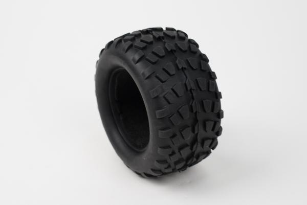

# Mount different tires

You can change the Rover tires to different compound \(toughness\) and thread easily. Just source for standard 1/10 RC-car tires of a certain specifications listed below.

## Tire specifications

* Inner rim diameter: 2.8"
* Outer diameter: ~ 125 mm
* Width: ~ 70 mm
* Typically described as for 1/10 scale Monster Truck RC vehicles


The dimensions may vary +- 10mm with no compatibility issues, remember the tires are made of rubber, they can stretch.


You can always look for different outer diameter tires, but it will change the Rover speed and force \(slope/climbing ability\). You can as well find different rubber compounds: softer or tougher ones. Keep in mind that softer compounds will affect the Rover turning resistance, but on the other hand will help climbing obstacles.

Higher outer diameter = higer speed & lower force

Lower outer diameter = lower speed & higher force

It's always a matter of compromise.

$$
Roverspeed [m/s]= wheeldiameter[m]*pi*motorspeed[rpm]/60
$$

$$
Roverforce[N]=4*motortorque[Nm]/wheeldiameter[m]
$$

## Useful links

Stock tires of Leo Rover are similar to these: [https://www.aliexpress.com/i/32735892787.html](https://www.aliexpress.com/i/32735892787.html)

For ex. you can look for tires to switch to here: [https://www.rcplanet.com/1-10-monster-truck-tires/](https://www.rcplanet.com/1-10-monster-truck-tires/)

