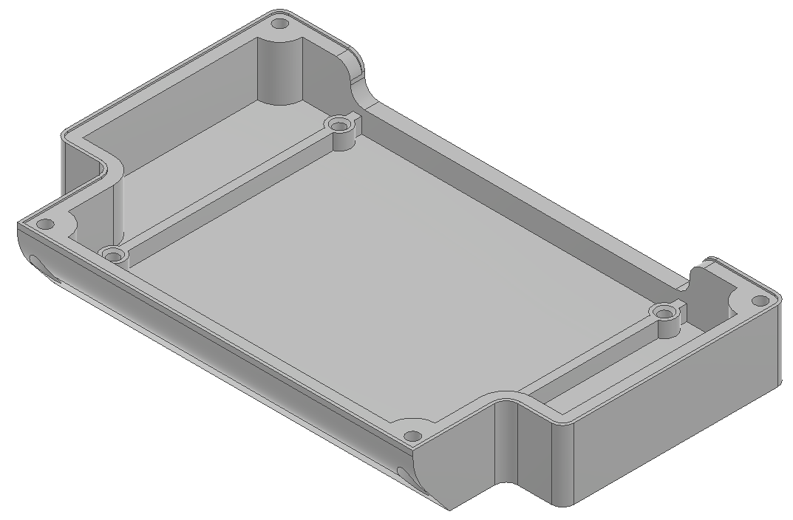
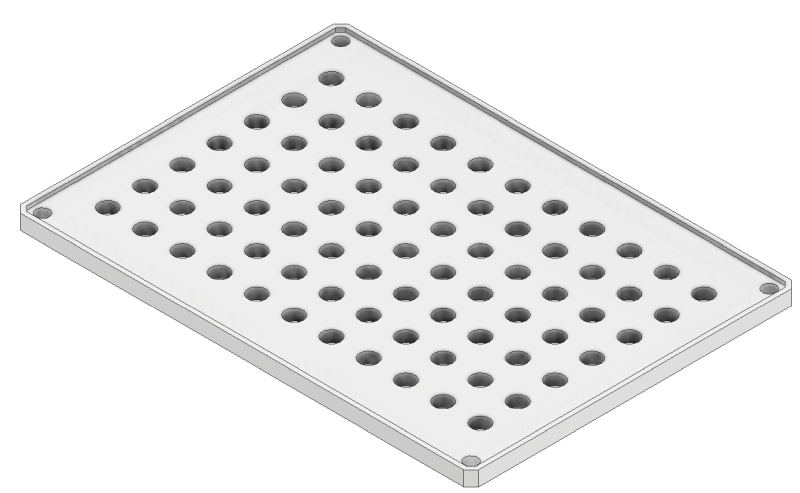
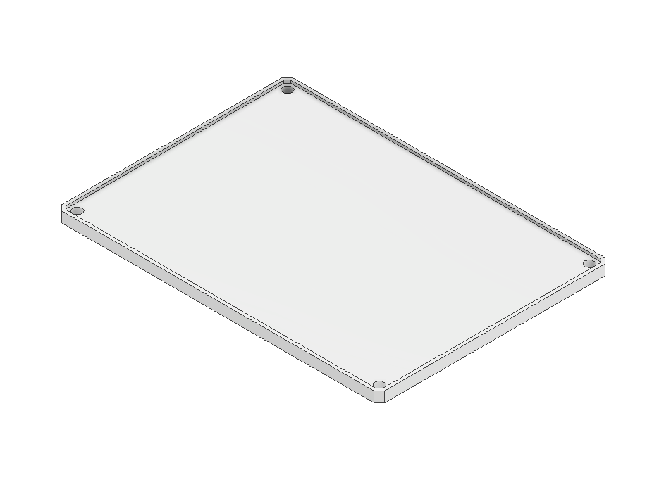

# Dev-Covers for addons

## Intro

A stock Main Electronics Box is designed to be waterproof and to encapsule all the electronics needed for the Rover operation. However, Core2-ROS board provides much more functionalities than the ones needed for default use. To take advantage of the functionalities you'll need to either mount your own electronics inside or outside of the Box.

Below you'll get example designs of the covers and mounting plates prepared to start your own projects.


Mind that the mounting points in the covers are provided using brass threaded inserts that are heat-presed in the 3d-print using a soldering iron. Make sure you get the inserts before you print your own cover:

[https://eu.shop.bossard.com/group/en/9429/nuts-inserts/threaded-inserts/bn-1936\_press-in-threaded-inserts-for-thermoplastics-and-thermosetting-plastic](https://eu.shop.bossard.com/group/en/9429/nuts-inserts/threaded-inserts/bn-1936_press-in-threaded-inserts-for-thermoplastics-and-thermosetting-plastic)


All the files are available in our GDrive repository under "\[04\] Dev-Covers":



## 00188 - Closed MEB cover

This one comes stock with the Rover. It's designed to be watertight and provide 4x m3 mounting points for 00189 Mounting Plate.

## 00188\_dev - Easy-access cover

If you don't need any water protection and need to route any cables for addtional electronics - the best way is to use the easy-access cover. It provides a 120x12mm opening at the rear of MEB.

## 00189 - Universal mounting plate

It's designed to fit both stock and Dev-Covers. The plate has a grid of 11x7 4.8mm holes \(to fit m4 screws\) and is 3mm thick. If you don't want to redesign the plate and need something to connect your own electronics, just 3d-print this one as a starting point.

## 00189\_smooth - Editable mounting plate

This one is easier to open in any 3d-modelling software to just add any holes and extrusions you need for your projects.

## Archive - Easy-access cover for Leo Rover 1.5

This cover can be used for older Leo Rovers with square Main Electronics Box. It's compatible with all the 00189 mounting plates.



