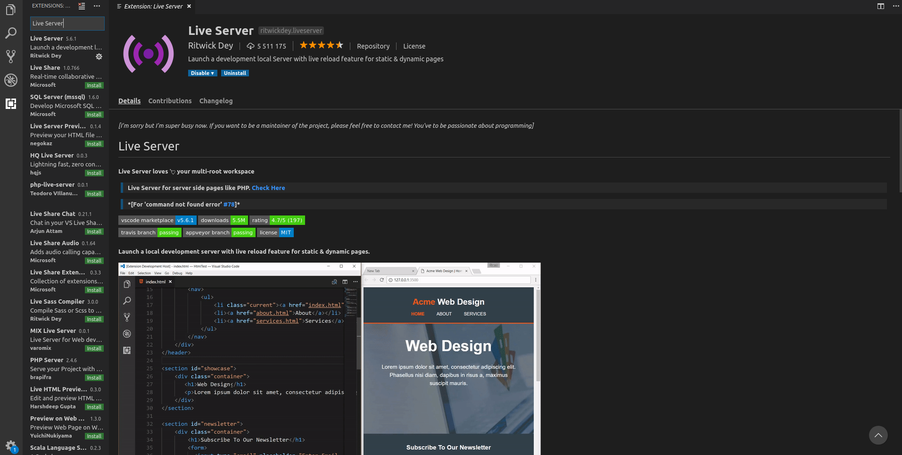
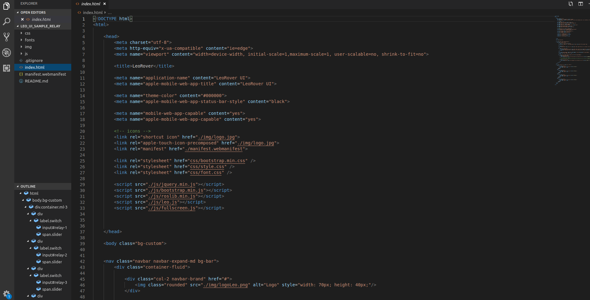
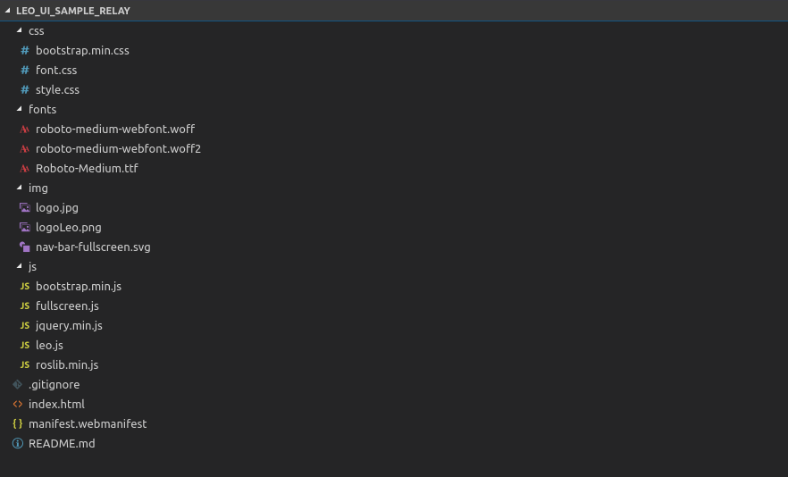

# Make your own UI - Relay switches

In this tutorial we will show you how to build your custom user interface based on sample UI prepared for the relays.


## 1. Prepare programing environment

### 1. Tool for code editing

Although you don't need any specific tools to develop the interface, we strongly recommend using Visual Studio Code to edit the code. There are some useful tools which can be helpful in the development.

### 2. Download Visual Studio Code



### 3. Download sample UI

First, prepare a directory for your workspace. We will put UI files in the directory.

1. If you have git tool,  you can clone it directly to your directory from LeoRover GitHub by typing

```text
git clone https://github.com/LeoRover/leo_ui_sample_relay.git
```

2. In other case you can download it directly from [https://github.com/LeoRover/leo\_ui\_sample\_relay](https://github.com/LeoRover/leo_ui_sample_relay) and upload the files manually.



### 4. VSC configuration

Open leo\_ui\_sample\_relay directory in VS Code. To see the website changes live we'll install VS Code extension called Live Server.




If sample UI code is opened and extension is added correctly you should see image like below.




## 2. Contents of leo\_ui\_sample\_relay directory



Screenshot of directory tree shows content of directory. As you can notice leo\_ui\_sample\_relay directory contains four subdirectories: css, fonts, img, js and file index.html. The rest of files are not necessary. Check content of every file inside these directories. 

In UI we used open sourced libraries. Check them using links on the list below.

* Bootstrap 4 [https://getbootstrap.com/](https://getbootstrap.com/)
* roslibjs [http://wiki.ros.org/roslibjs](http://wiki.ros.org/roslibjs)
* jQuery [https://jquery.com/](https://jquery.com/)


In the following part of tutorial we will focuse on index.html and leo.js file and application of included libraries. If you would like to know more check [https://www.w3schools.com/html/](https://www.w3schools.com/html/) and API/documentacion of included libraries.


## 3. Code description step by step

### index.html

First part of HTML code is head. It contains information how web browser should interpret code

* character encoding for the HTML document
* title and website logo 
* custom settings
* included libraries \(be sure that file path is correct\)

```text
<head>
	<meta charset="utf-8">
	<meta http-equiv="x-ua-compatible" content="ie=edge">
	<meta name="viewport" content="width=device-width, initial-scale=1,maximum-scale=1, user-scalable=no, shrink-to-fit=no">

	<title>LeoRover</title>

	<meta name="application-name" content="LeoRover UI">
	<meta name="apple-mobile-web-app-title" content="LeoRover UI">

	<meta name="theme-color" content="#000000">
	<meta name="apple-mobile-web-app-status-bar-style" content="black">

	<meta name="mobile-web-app-capable" content="yes">
	<meta name="apple-mobile-web-app-capable" content="yes">

	<!-- icons -->
	<link rel="shortcut icon" href="./img/logo.jpg">
	<link rel="apple-touch-icon-precomposed" href="./img/logo.jpg">
	<link rel="manifest" href="./manifest.webmanifest">

	<link rel="stylesheet" href="css/bootstrap.min.css" />
	<link rel="stylesheet" href="css/style.css" />
	<link rel="stylesheet" href="css/font.css" />

	<script src="./js/jquery.min.js"></script>
	<script src="./js/bootstrap.min.js"></script>
	<script src="./js/roslib.min.js"></script>
	<script src="./js/leo.js"></script>
	<script src="./js/fullscreen.js"></script>


</head>
```

### index.html

Secon part of HTML code is body. It contains decsription how our website look like and inicialization of JavaScript function.

In the begining of body part ther is description of website nav bar. Every class used below is from Bootstarp 4 library. If you want to know more or  build your custom nav bar check this: [https://getbootstrap.com/docs/4.3/components/navbar/](https://getbootstrap.com/docs/4.3/components/navbar/)

```text
<nav class="navbar navbar-expand-md bg-bar">
		<div class="container-fluid">
			
			<div class="col-2 navbar-brand" href="#">
				
			</div>

			<div class="col-3" >
				<div id="batteryID" class="center-fit" style="width: 70px; height: 40px; color: aliceblue; text-align: center;">Voltage: 0V</div>
			</div>

			<div class="col-2 text-center">
				<button class="bg-dark btn-sm mx-auto" style="width: 45px; height: 45px;" type="button" onclick="fullScreen()">
					
				</button>
			</div>

			<button class="navbar-toggler" type="button" data-toggle="collapse" data-target="#collapsibleNavbar">
				<span class="navbar-toggler-icon"></span>
			</button>

			<div class="col-5 collapse navbar-collapse ml-auto" id="collapsibleNavbar">
				<ul class="navbar-nav ml-auto">
				<li class="nav-item ml-auto">
					<button type="button" class="btn btn-warning btn-sm custom-btn mt-2 ml-3" onclick="systemReboot()">Reboot</button>
				</li>
				<!-- <li class="nav-item ml-auto">
					<button type="button" class="btn btn-warning btn-sm custom-btn mt-2 ml-3" onclick="streamReboot()">Reboot stream</button>
				</li> -->
				<li class="nav-item ml-auto">
					<button type="button" class="btn btn-danger btn-sm custom-btn mt-2 ml-3" onclick="turnOff()">Turn off</button>
				</li>
				</ul>
			</div>
		</div>
	</nav>
```

Probably if you were studying nav bar code you have noticed function call "oncilick". We are using it to intialize functions after specyfic buttons on nav bar are presed.

List of functions initiazlize after buttons pressed:

* fullScreen\(\)
* systemReboot\(\)
* turnOff\(\)

Description of how these functions works you will find in leo.js paragraph.

### index.html

Next in body part of HTML code we can notice description of relay switches. If switch is pressed, functions are initialized. These functionsalso will be described in leo.js paragraph.


Check description of Bootstrap 4 switches class: [https://getbootstrap.com/docs/4.3/components/forms/\#switches](https://getbootstrap.com/docs/4.3/components/forms/#switches)


```text
<div class="container ml-3" style="color: #ffffff">
	<div >
		<label class="switch">
			<input type="checkbox" id="relay-1" onclick="rel1Trig()">
			<span class="slider"></span>
		</label>
		Relay 1
	</div>
	<div>
		<label class="switch">
			<input type="checkbox" id="relay-2" onclick="rel2Trig()">
			<span class="slider"></span>
		</label>
		Relay 2
	</div>
	<div>
		<label class="switch">
			<input type="checkbox" id="relay-3" onclick="rel3Trig()">
			<span class="slider"></span>
		</label>
		Relay 3
	</div>
	<div>
		<label class="switch">
			<input type="checkbox" id="relay-4" onclick="rel4Trig()">
			<span class="slider"></span>
		</label>
		Relay 4
	</div>
</div>
```

### leo.js


Code description will be soon ;-\)


```text
var manager;
var ros;
var batterySub;
var robot_hostname;
var batterySub;

function initROS() {

    ros = new ROSLIB.Ros({
        url: "ws://" + robot_hostname + ":9090"
    
    });

    relay1Pub = new ROSLIB.Topic({
        ros: ros,
        name: '/relay1',
        messageType: 'std_msgs/Bool',
        queue_size: 5
    });

    relay2Pub = new ROSLIB.Topic({
        ros: ros,
        name: '/relay2',
        messageType: 'std_msgs/Bool',
        queue_size: 5
    });

    relay3Pub = new ROSLIB.Topic({
        ros: ros,
        name: '/relay3',
        messageType: 'std_msgs/Bool',
        queue_size: 5
    });

    relay4Pub = new ROSLIB.Topic({
        ros: ros,
        name: '/relay4',
        messageType: 'std_msgs/Bool',
        queue_size: 5
    });

    relay1Pub.advertise();
    relay2Pub.advertise();
    relay3Pub.advertise();
    relay4Pub.advertise();

    systemRebootPub = new ROSLIB.Topic({
        ros: ros,
        name: '/system/reboot',
        messageType: 'std_msgs/Empty'
    });
    systemRebootPub.advertise();

    systemShutdownPub = new ROSLIB.Topic({
        ros: ros,
        name: '/system/shutdown',
        messageType: 'std_msgs/Empty'
    });
    systemShutdownPub.advertise();

    batterySub = new ROSLIB.Topic({
        ros : ros,
        name : '/battery',
        messageType : 'std_msgs/Float32',
        queue_length: 1
    });
    batterySub.subscribe(batteryCallback);

}

function batteryCallback(message) {
    document.getElementById('batteryID').innerHTML = 'Voltage: ' + message.data.toPrecision(4) + 'V';
}

function systemReboot(){
    systemRebootPub.publish()
}

function turnOff(){
    systemShutdownPub.publish()
}


function rel1Trig(){
    var relayMsg;
    var checkBox = document.getElementById("relay-1");

    if (checkBox.checked == true){
       relayMsg = new ROSLIB.Message({
            data: true
        });
    }
    else {
        relayMsg = new ROSLIB.Message({
            data: false
        });
    }
    relay2Pub.publish(relayMsg);
    
}

function rel1Trig(){
    var relayMsg;
    var checkBox = document.getElementById("relay-1");

    if (checkBox.checked == true){
       relayMsg = new ROSLIB.Message({
            data: true
        });
    }
    else {
        relayMsg = new ROSLIB.Message({
            data: false
        });
    }
    relay1Pub.publish(relayMsg);
    
}

function rel2Trig(){
    var relayMsg;
    var checkBox = document.getElementById("relay-2");

    if (checkBox.checked == true){
       relayMsg = new ROSLIB.Message({
            data: true
        });
    }
    else {
        relayMsg = new ROSLIB.Message({
            data: false
        });
    }
    relay2Pub.publish(relayMsg);
    
}

function rel3Trig(){
    var relayMsg;
    var checkBox = document.getElementById("relay-3");

    if (checkBox.checked == true){
       relayMsg = new ROSLIB.Message({
            data: true
        });
    }
    else {
        relayMsg = new ROSLIB.Message({
            data: false
        });
    }
    relay3Pub.publish(relayMsg);
    
}

function rel4Trig(){
    var relayMsg;
    var checkBox = document.getElementById("relay-4");

    if (checkBox.checked == true){
       relayMsg = new ROSLIB.Message({
            data: true
        });
    }
    else {
        relayMsg = new ROSLIB.Message({
            data: false
        });
    }
    relay4Pub.publish(relayMsg);
    
}

function shutdown() {
    relay1Pub.unadvertise();
    relay2Pub.unadvertise();
    relay3Pub.unadvertise();
    relay4Pub.unadvertise();
    systemRebootPub.unadvertise();
    systemShutdownPub.unadvertise();
    batterySub.unsubscribe();
    ros.close();
}

window.onload = function () {

    robot_hostname = location.hostname;

    initROS();

    window.addEventListener("beforeunload", () => shutdown());
}


```

