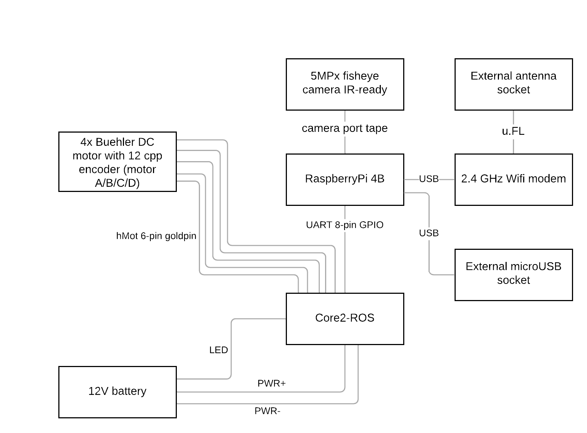

# Hardware Structure

## Hardware structure

## Interface pinout

### 3-pin power connectors

 

| Pin name  | Cable color |
| :--- | :--- |
| power \(-\) | black |
| power \(+\) | red / black with white stripe |
| LED | green |

