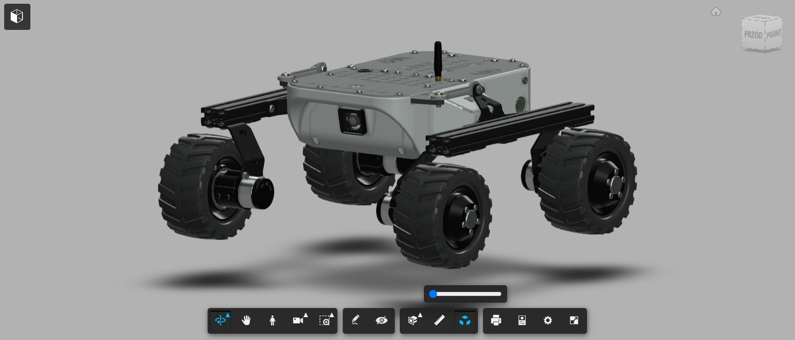

# Downloads

## LeoOS - SD card image for the Rover's computer



## Firmware for the Core2 controller



## Leo Rover 3D model

## Preview and download here:



## 3D-printing files



## CAD files repository \(3D models for addons, etc.\)



