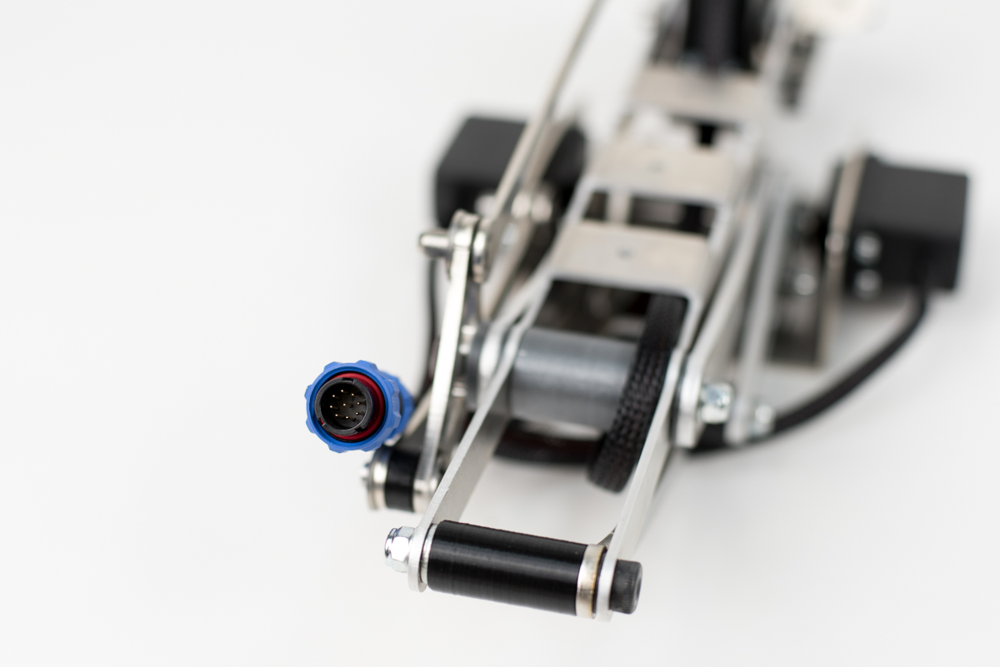
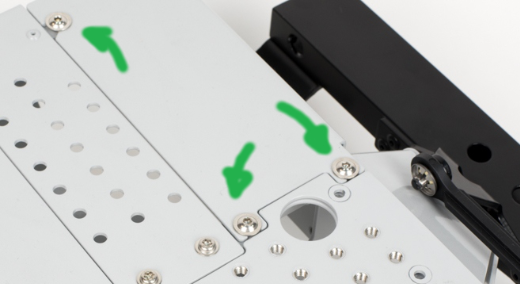
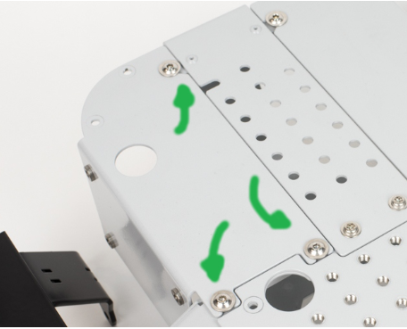

# Getting started

## **Before you power on the Rover**

### **How to use Leo Rover connectors?**




First, make sure you are connecting the right pair of the connectors, the male and female connector should have the same number of pins. Then find a white spot on both the male and female connector body and fix the connectors with the spots pointing each other. Then manually screw the blue nut to secure the connection.

The connectors should fit with no play and the nut should be screwed straightly with no excessive friction.

### How to connect the battery to the Rover?

Connect the mating pair of the 3-pin connectors: the battery and the converter located on the opposite side of the Rover. Then fit the battery cables inside the Rover back-rib and slide the battery on back-left quarter of the Rover body. Tighten the 3x M5 screws using the screwdriver provided.



### How to connect the converter quarter to the Rover?

Connect the mating pair of the 3-pin connectors: the electronics box and the converter. Then fit the battery cables inside the Rover back-rib and slide the converter on back-right quarter of the Rover body. Tighten the 3x M5 screws using the screwdriver provided.



## Operation & maintenance

### **How to connect to the Rover?**

To connect to the Rover, turn Leo on using its main power button located on the left side of the battery. The button will be lighted green when turned on.

After ca. 60 s the Rover system should begin to work, check your controller device for WiFi network:

```text
Name: LeoRover[+serial number]
Password: password
```

For instructions on how to change WiFi network credentials, you can visit this page:



Connect to the network.

To access Web User Interface, enter your web browser and type in the address line:

```text
http://10.0.0.1/
```

### Leo Rover UI \(leo\_ui\)


### **Turn off the Rover properly**

Due to the system architecture the Rover needs to be turned off the old-school style. Before you click the power button located on the battery it's better to turn off the computer at first.

To do that click upper right corner icon, wait until the Rover shuts down \(WiFi network will disappear\) and shut down the battery.


This way you'll extend the life of the software filesystem.


### **Battery charging**

First, disconnect the battery from the rover. To do that, untighten 3x inner hex head screws located on the rear left side of the rover. Then slide the battery off the rover frame and disconnect the 3-pin connector.

Connect the charger provided with the Rover to AC power socket - LED located on the charger will light green.

Connect the battery to the charger and click the battery button. The charger LED will change from green to red - meaning that it's charging now.

When the battery is fully charged LED on the battery should turn back green. Turn the battery off and connect it back to the rover.


Do not click the button during charging!


### Software update

Refer to:



