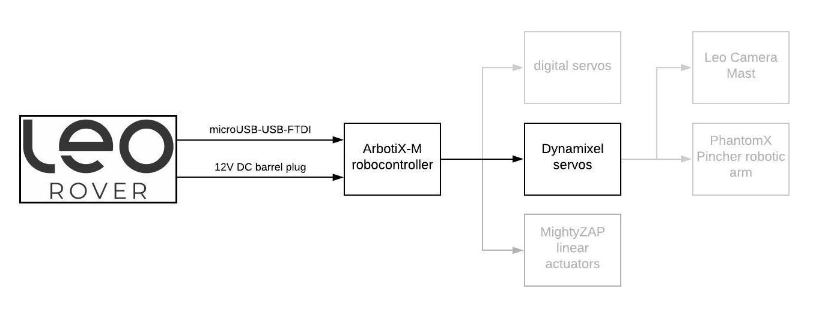

# ArbotiX-M Robocontroller




This tutorial will show you how to use the Arbotix-M Robocontroller board to control DYNAMIXEL servos with ROS. 


## 1. Flash the Arbotix board

Before you can use the Arbotix board with ROS, you need to flash a proper firmware. Follow the [Quick Start Guide](https://learn.trossenrobotics.com/arbotix/7-arbotix-quick-start-guide) from TrossenRobotics to learn how to program the board with Arduino IDE.

If you have successfully programmed the example sketches, open and upload the following sketch:

```text
File -> Sketchbook -> ArbotiX Sketches -> ros
```

The rest of this tutorial can be done in any machine that runs ROS and have an Internet connection. It can be Leo Rover





or your computer



## 2. Install Arbotix ROS driver

The driver for Arbotix board is distributed in [arbotix](http://wiki.ros.org/arbotix) package. It can be installed from official repository just by typing:

```text
sudo apt install ros-[DISTRO]-arbotix
```

replace `[DISTRO]` with either `kinetic` or `melodic` depending on your system.

## 3. Set Dynamixel IDs and test the servos

Make sure your setup looks like this:


Then, type in your console:

```text
arbotix_terminal
```


`arbotix_terminal` by default, assumes the board is connected on `/dev/ttyUSB0` port. If it is attached to another device, you can specify it like this: 

```text
arbotix_terminal [PORT]
```

To check which port the device connects to, you can, for instance, run `dmesg -w` \(Ctrl+C to exit\), connect the device and check kernel logs. 

If you are using Ubuntu on `Windows Subsytem for Linux` , you need to open Device Manager and look under Ports for COM port number of the device. `COM[N]` corresponds to `/dev/ttyS[N]` path. \(e.g. COM4 -&gt; /dev/ttyS4\). You might need to run:

```text
 sudo chmod 666 /dev/ttyS[N]
```


A terminal prompt should appear. Type `help` for the list of commands.


Connect the Dynamixel you want to set id to. Then type `ls` to see id of connected servo and `mv [source] [target]` to change it. For example, when the servo has ID 1 and we want to set it to 2, just type:

```text
mv 1 2
```


When you have connected multiple servos, this command will change ALL servos with ID `[source]` \(1 in this example\) to ID `[target]`.


You can also read and change some parameters to test servo movement with `get` and `set` commands. For example, to read current position of servo with ID 1, type:

```text
get pos 1
```

To move the servo to position 300 \(the range is between 0 and 1023\), type:

```text
set pos 1 300
```

To set the goal speed of the servo to half of the maximum, type:

```text
set spd 1 512
```

The servo should start moving continuously in one direction.

## 4. Test the ROS driver

We will create a package that tests the arbotix driver. Let's start by creating a catkin workspace \(if you don't have one yet\):

```bash
mkdir -p ~/ros_ws/src && cd ~/ros_ws/
catkin init
catkin config --extend /opt/ros/melodic
```

and an empty package:

```bash
cd ~/ros_ws/src
catkin create pkg arbotix_test --catkin-deps arbotix_python
```

Inside the package, create `config/test.yaml` file with the following content:

```yaml
port: /dev/ttyUSB0
rate: 15
joints: {
    servo1: {id: 1},
    servo2: {id: 2},
    servo3: {id: 3},
    servo4: {id: 4},
    servo5: {id: 5}
}
```


You might need to change to `port` parameter



You can set more parameters for each joint, like maximum speed, minimum and maximum angle etc. A brief documentation \(Unfortunately, a little outdated\) can be found [here](http://wiki.ros.org/arbotix_python#Parameters).


And `launch/test.launch` with the following:

```markup
<launch>
  <node name="arbotix_driver_test" pkg="arbotix_python" type="arbotix_driver" output="screen">
    <rosparam file="$(find arbotix_test)/config/test.yaml" command="load" />
  </node>
</launch>
```

Build the package and `source` the result space:

```bash
cd ~/ros_ws
catkin build
source devel/setup.bash
```

Now, run the launch file, by typing:

```bash
roslaunch arbotix_test test.launch
```

You should see new topics spawned \(check with `rostopic list`\): 

```bash
/joint_states
/servo1/command
/servo2/command
/servo3/command
/servo4/command
/servo5/command
```

And new services \(check with `rosservice list`\):

```bash
/servo1/enable
/servo1/relax
/servo1/set_speed
/servo2/enable
...
```

To shortly summarize the features:

* `/servoX/command` topic will enable the torque and move the servo with ID X to a specified position if published to. The position is specified in radians.
* `/servoX/enable` service will just enable the torque on the servo.
* `/servoX/relax` service will relax the servo \(disable the torque\).
* `/servoX/set_speed` service will set the speed the servo will move with when it receives a new command. The speed is specified in radians per second.
* The current joint positions and velocities are published to `/joint_states` topic.

We can try to test the features using `rostopic` and `rosservice` tools.

Assuming you have connected the servo with ID 1, start by setting a the speed to a safe value \(0.2 r/s in this case\):

```bash
rosservice call /servo1/set_speed 0.2
```

Move servo to a default neutral value:

```text
rostopic pub /servo1/command std_mgs/Float64 -- 0.0
```


The maximum angle range for a Dynamixel servo is \[-150, 150\] degrees which is equal to approximately \[-2.62, 2.62\] in radians


Relax joint:

```text
rosservice call /servo1/relax
```

