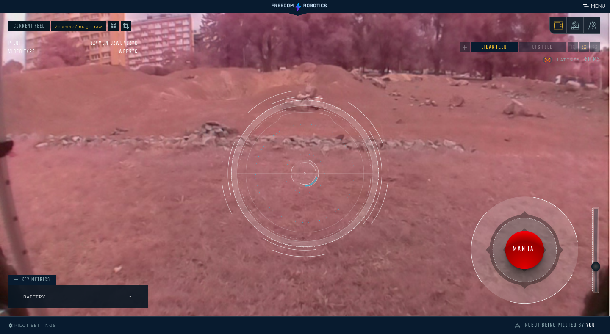

# Freedom Robotics


## Introduction

> Freedom's Pilot teleoperation enables extremely low latency \(50-200ms round trip\) and fully customizable control of your robot - from real-time driving to triggering missions to custom commands for manipulation and navigation. 
>
> All in an intuitive-to-use interface designed for tablets, phones and desktops in the real-world, where you need to be able to drop your interface, pick it up, and continue on. Source: freedomrobotics.ai

You can use it together with stock Leo Rover UI with only simple steps needed to integrate. 

This way you'll be able to connect to the Rover via Internet from anywhere you want. Together with remote driving functionality, Freedom Robotics allows for data streaming, 3D-mapping visualisation, GPS data overlay on map, and much more.

See more: [https://www.freedomrobotics.ai/](https://www.freedomrobotics.ai/)



## Install Freedom Robotics agent on Leo Rover

### Create an account in Freedom Robotics website



You can choose either free trial, paid plan or use any dedicated discount code.

Connect to the Rover via SSH and connect the Rover to the Internet.





### Generate a custom curl command that will install Freedom Robotics agent

Log in to your Freedom Robotics account and click GET STARTED on the left sidebar. Answer the questions and add new device. Choose "new device" and "new type" rather than any pre-set one to make sure you don't start with strange settings added.

After the onboarding process you'll receive a curl command to run in the Rover console. The command should look similar to the one below.

```
curl -sSf "https://api.freedomrobotics.ai/accounts/[...]&install_elements=webrtc&auto_install_deps=true&ppa_is_allowed=true" | python
```


Make sure that remote SSH and WEB RTC options were enabled. You should see “install\_elements=webrtc" snippet in the code.


### Run the generated command in Leo Rover console

It will take a while. After the installation is complete you can close the console.


If you ran into any installation issues, take a look at the [Installation Help](https://docs.freedomrobotics.ai/docs/installation) guide. If you're still stuck, please [reach out](https://docs.freedomrobotics.ai/docs/contact-us).



 Congratulations! The service is now installed and will start with every boot of the system.


## Connect to the Rover via Freedom Robotics platform

1. Log in to your [Freedom App](https://app.freedomrobotics.ai/).
2. Click the first fleet.
3. Choose the first device. It's status should be automatically set as active when your Rover is working.
4. Click "Go to Device" in the lower right corner.

Now you are in the Status Mode of the interface. You can play with the modes to learn how to navigate in the interface.

To learn more: [https://docs.freedomrobotics.ai/docs/start-monitoring](https://docs.freedomrobotics.ai/docs/start-monitoring)

## Leo Rover basic setup

Now we need to modify several settings that are specific to Leo Rover.

### Bandwidth tab

Go to: Settings-&gt;Bandwidth

Here you can see all the topics \(ROS topics\) that are monitored by the interface. By default the platform listens to all the topics ran on the Rover \( `*/` entry in Included Topics\). It's better to exclude the ones that are not needed.

Please delete the `*/` entry.

Now add the topics that are specific to Leo Rover.

To use the basic funcionality of the Rover you should include the topics below. These are the topics that are listened to by the platform. You can choose not to monitor any of the topics, but keep in mind they won't show in the interface as long they are not here. 

* `/camera/image_raw` \(main camera image\)
* `/battery` \(battery voltage meter\)
* `/wheel_odom` \(encoders readings\)
* `/tf` \(translation vector\)
* `/diagnostics` \(as named\)


/cmd\_vel is published by default so you don't need to add it. 


See more: [https://docs.freedomrobotics.ai/docs/bandwidth-tuning](https://docs.freedomrobotics.ai/docs/bandwidth-tuning)

### Pilot tab

Go to: Settings-&gt;Pilot.

Modify /cmd\_vel max angular velocity to 60deg/s and max linear velocity to 0.5m/s \(these are closer to the real speeds the Rover can go\).

These paramteres will modify the UI joystick scale to the proper realistic values.

## Pilot the Rover

Go to the Pilot Mode \(in the left menu\).

You should see jpeg video stream in the background and UI features together with a red joystick. Everyone who is logged to your account can see the same view as a spectator, but only one person can take over the control.

Click Take Over in the upper section of the video stream. Wait couple of seconds until the streaming method is changed from JPEG stream to WebRTC \(you'll see that the notice in the image center changes\).

Now you're able to drive the Rover.

See more: [https://docs.freedomrobotics.ai/docs/start-control](https://docs.freedomrobotics.ai/docs/start-control)


## Example: Add IMU data streaming

Assemble IMU module to your Rover and follow the IMU tutorial to enable IMU data streaming to ROS environment.



Now add new topic to Included topics in Settings -&gt;Bandwidth. 

Include `/imu*`


Congratulations! IMU data is streaming - check in Streaming Mode.


