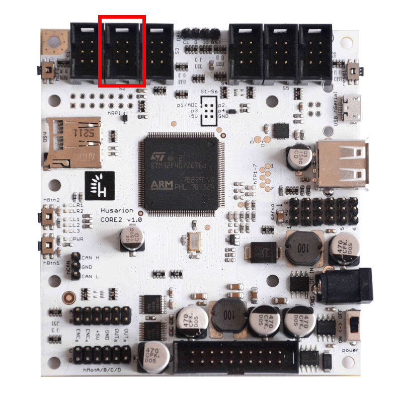

# Inertial Measurement Unit \(IMU\)

In this tutorial, we will show you how to connect and use IMU module on your Rover.



## Prerequisites

First, make sure you have a compatible IMU module. We recommend `Grove - IMU 9DOF v2.0` but any module with `MPU-9250` sensor should work.


IMU functionality was introduced in [leo\_firmware](https://github.com/LeoRover/leo_firmware/releases) version 0.5, so make sure to stay updated.





## Mounting and wiring the sensor

By default, the IMU will work on hSens2 port. You can change it to hSens1 by modifying the [params.h](https://github.com/LeoRover/leo_firmware/blob/master/params.h) file in `leo_firmware`. 



Connect the sensor pins according to the [CORE2 manual](https://husarion.com/manuals/core2/#hsensor).


| hSens pin | IMU pin |
| :--- | :--- |
| 3 | SCL |
| 4 | SDA |
| 5 | +5V |
| 6 | GND |

You can use female jumper cables, or create your own IDC cable, like this one:


If you use the Grove IMU, you can 3D print the mounting plate for the MEB cover which contains holes for the self-tapping screws \(`00189_imu` part\). The files can be found here:



## Integrating the sensor with the system

### Turning on the IMU functionality

Log in to the Rover's console via SSH



To set IMU functionality on or off, you need to send message on the `/core2/set_imu` topic.

```bash
rostopic pub /core2/set_imu std_msgs/Bool true
```

Now, you need to reset the board to apply changes. You can do this by turning on and off the whole Rover, or by sending an empty message on the `/core2/reset_board` topic.

```bash
rostopic pub /core2/reset_board std_msgs/Empty
```

After the board reset, new topics should spawn: `/imu/gyro`, `/imu/accel`,  `/imu/mag` on which IMU gyroscope, accelerometer and magnetometer readings are published. \(you can check available topics with `rostopic list`\)

Check if the readings are correct with `rostopic echo`, for example:

```text
rostopic echo /imu/gyro
```

#### sensor axes and units

The sensor's accelerometer and gyroscope X, Y and Z axes should be printed on the board. If they are not, you can check MPU9250 IC orientation and identify the axes with this drawing:


The magnetometer axes were also transformed to these axes to comply with the North-West-Up world frame.

The gyroscope data \(`imu/gyro` topic\) represents angular velocity around sensor's axes in rad/s \(radians per second\).  
The accelerometer data \(`imu/accel` topic\) represents linear acceleration along sensor's axes in m/s2 \(meters per second squared\).  
The magnetometer data \(`imu/mag` topic\) represents magnetic field along sensor's axes in G \(Gauss\).

### Extending the URDF model

The system should be aware of where the module is located on the robot, in order to be able to use the sensor readings. To specify the location, you can extend the URDF model of the Rover by editing the `/etc/ros/urdf/robot.urdf.xacro`. Simply open the file in `nano` editor by typing:

```bash
sudo nano /etc/ros/urdf/robot.urdf.xacro
```

Add these lines somewhere between the `<robot>` tags:

```markup
<link name="imu"/>

<joint name="imu_joint" type="fixed">
  <parent link="base_link"/>
  <child link="imu"/>
  <origin xyz="0.027 0 -0.07" rpy="0 0 0"/>
</joint>
```

`imu` link represents the reference frame of the sensor readings.  
`base_link` is the origin of the robot.  
`imu_joint` specifies the transformation between these two links.

You might need to modify the transformation \(`<origin>` tag\) depending on how you mounted the module.


For more information, visit **ROS Development** -&gt; **Adding additional functionality to the rover** -&gt; **expanding the URDF model**



### Calibrating the sensor

The firmware also provides services that perform sensor calibration and store the results in a persistent storage.

#### calibrate gyroscope and accelerometer biases

To calibrate gyroscope and accelerometer biases, just place the Rover on a flat surface, parallel to the ground and call the calibration service:

```bash
rosservice call /imu/calibrate_gyro_accel
```

#### calibrate magnetometer

Calibrating the magnetometer is a bit more difficult task, as it requires collection of a whole range of measurements on each axis. The method that works best is to move the sensor in a [3-dimensional figure eight](https://www.youtube.com/watch?v=zrEzMggOnFQ), however, such motion can be hard to accomplish with the whole Rover. 

To start the calibration, just call the service:

```bash
rosservice call /imu/calibrate_mag
```

After 4 seconds, the firmware should start data collection. After another 15 seconds, the service should return success message. Try to move the sensor in a varied motion for the whole duration of the service call.


When you change the sensor position on the Rover, the hard-iron distortion may change and invalidate previous calibration data, so, before performing the magnetometer calibration, make sure the sensor is located at the designated place.


