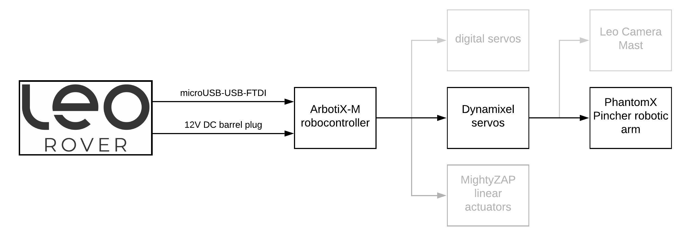
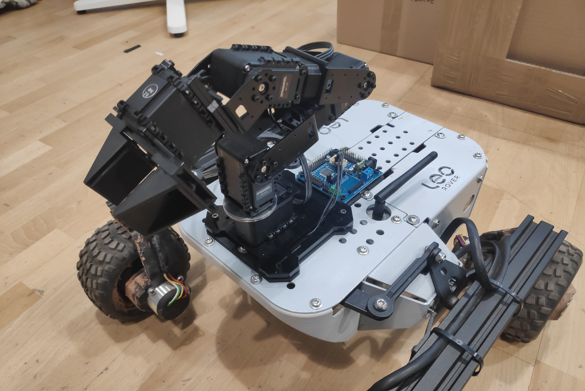

# PhantomX Pincher \(Robotic Arm\)




In this tutorial, we will show you how to configure and remotely control PhantomX Pincher Robot connected to the Rover.

> The PhantomX Pincher AX-12 Robot Arm is a 4 degree-of-freedom robotic arm and an easy addition to the TurtleBot ROS robot platform. This hardware kit comes with everything needed to physically assemble and mount the arm as a standalone unit or as an addition to your Turtlebot Robot/mobile platform. \[source: [trossenrobotics.com](https://www.trossenrobotics.com/p/PhantomX-Pincher-Robot-Arm.aspx)\]

The arm has been redesigned to fit Leo Rover mounting plate. As the arm baseplate has became thinner, its range allows to grab objects from the ground as well as reach the rear and sides of Leo Rover.


## Assembling the arm

You'll follow the official instructions from [Trossen Robotics' website](https://learn.trossenrobotics.com/16-interbotix/robot-arms/pincher-robot-arm/163-phantomx-pincher-robot-arm-assembly-guide.html) to assemble the arm with only few exceptions that are specific to Leo Rover mounting interface.

* In `Step 1: Build the Upper Deck`, point 8:
  * instead of using a 100 mm cable as shown in the photo, use the 150 mm cable that is included in Leo Rover to PhantomX adapter kit.
* In `Step 2: Build the Base`, instead of point 2-6:
  * use the lower deck provided with the Leo Rover to PhantomX adapter kit instead of the default one,
  * assemble the lower deck \(adapter\) to Leo Rover mounting plate using 2x M5 screws and the provided nuts,
  * attach the upper deck \(from Step 1\) to the lower deck using 4x M3 screws included, route the servo cable \(150 mm version\) facing the rear of the lower deck,
  * attach the ArbotiX-M controller to the lower deck using 4x M3 screws included, the board power socket needs to face the rear of the Rover.
* To power the ArbotiX-M controller, use the cable provided in the kit \(triple connector\). The cable should be used instead of standard MEB-to-Battery cable with barrel jack cable routed through one of the cutouts in the rear frame.
* To connect the ArbotiX-M controller FTDI-USB cable use miniUSB-USB adapter provided in the kit and plug it in the miniUSB socket on top of the Rover.





## Setting servo IDs

To properly communicate with the Dynamixel servos, you will need to set the servo IDs like in the picture below:


To do this, you can follow our guide for the Arbotix controller here:



In there, you will also find how to configure and use the [arbotix ROS driver](http://wiki.ros.org/arbotix).

## Installing ROS packages

The [pincher\_arm](http://wiki.ros.org/pincher_arm) packages contain very useful utilities for PhantomX Pincher arm, such as:

* configuration for the arbotix driver
* [URDF](http://wiki.ros.org/urdf) model of the arm
* [Moveit!](https://moveit.ros.org) configuration package
* [IKFast](http://docs.ros.org/kinetic/api/moveit_tutorials/html/doc/ikfast/ikfast_tutorial.html) Kinematics solver plugin
* MoveIt! pick and place demo

To use these features, you will need to install these packages on your Rover \(to run the arm driver\) and on your computer \(to control the arm remotely\).

### On you computer

Make sure you have ROS installed:



then type in the terminal:

```bash
sudo apt update
sudo apt install ros-<distro>-pincher-arm ros-<distro>-leo-desktop
```


Replace `<distro>` with the ROS distribution you have installed on your computer \(e.g. `melodic`\). 


### On the Rover

Make sure your Rover is connected to the Internet:



You will only need packages that are required to start the arm driver:

```bash
sudo apt update
sudo apt install ros-melodic-pincher-arm-bringup
```

### Building from source


If for some reason you want to build the packages manually, you can use the instructions below \(both for the Rover and your computer\).


Create an empty catkin workspace, if you don't have one yet:

```bash
mkdir -p ~/ros_ws/src && cd ~/ros_ws
catkin config --extend /opt/ros/melodic
```

Clone the packages into the source space:

```bash
cd ~/ros_ws/src
git clone https://github.com/fictionlab/pincher_arm.git
```

Install the dependencies:

```bash
cd ~/ros_ws
sudo apt update
rosdep update
rosdep install --from-paths src -iy
```

Build the workspace:

```bash
catkin build
```

Source the result space:

```bash
source ~/ros_ws/devel/setup.bash
```

## Integrating the arm with the Rover

You can start by testing if the driver runs properly.

Use [roslaunch](http://wiki.ros.org/roslaunch) to start the arm controllers:

```bash
roslaunch pincher_arm_bringup driver.launch --screen
```

If everything started without errors, you should see new topics spawned \(e.g. with `rostopic list`\) to which you can send position commands:

```bash
/arm_shoulder_pan_joint/command
/arm_shoulder_lift_joint/command
/arm_elbow_flex_joint/command
/arm_wrist_flex_joint/command
/gripper_joint/command
```

as well as services for setting speed and relaxing joints.  
You can learn more about them in the [ArbotiX-M Robocontroller tutorial](https://docs.leorover.tech/addons-manuals/arbotix-m-robocontroller).


The driver will also provide controllers for [FollowJointTrajectory](http://docs.ros.org/api/control_msgs/html/action/FollowJointTrajectory.html) and [GripperCommand](http://docs.ros.org/melodic/api/control_msgs/html/action/GripperCommand.html) actions \(see the [actionlib wiki](http://wiki.ros.org/actionlib) for more information\).


Now that you confirmed that the driver works, you can integrate it with the main Leo launch file and the URDF description.

Open the `/etc/ros/robot.launch` file in your favorite editor \(e.g. `nano`\) and add these lines before the closing `</launch>` tag:

```markup
  <include file="$(find pincher_arm_bringup)/launch/driver.launch">
      <arg name="port" value="/dev/ttyUSB0"/>
  </include>
```

Next, you will need to extend the robot's URDF description, by embedding the arm's description and adding a fixed joint between Leo and Pincher arm. To do this, edit `/etc/ros/urdf/robot.urdf.xacro` by adding these lines before the closing `</robot>` tag:

```markup
  <xacro:include filename="$(find pincher_arm_description)/urdf/pincher_arm.urdf.xacro"/>

  <joint name="arm_base_joint" type="fixed">
    <origin xyz="0.093 0 0.0265"/>
    <parent link="base_link"/>
    <child link="arm_base_link"/>
  </joint>
```

Restart the `leo` service to apply the changes:

```markup
sudo systemctl restart leo
```

## Controlling the arm

You will need to have ROS properly configured on your computer to communicate with the nodes running on your Rover. To learn how to do this, you can follow **Connecting other computer to ROS network** section of ROS Development tutorial:



To visualize the position of the arm in RViz, just type:

```markup
roslaunch leo_viz rviz.launch
```


To test Motion Planning with MoveIt! :

* Run `pincher_arm_moveit` launch file:

  ```text
  roslaunch pincher_arm_moveit_config pincher_arm_moveit.launch
  ```

* Click on `Planning` tab in Motion Planning display,
* Move interactive marker to the intended goal position of the end effector,
* Click on `Plan` to see Motion visualization and then `Execute` or just click on `Plan and Execute`
* Run pick and place demo \(in another terminal session\):

  ```text
  rosrun pincher_arm_moveit_demos pick_place‌
  ```


