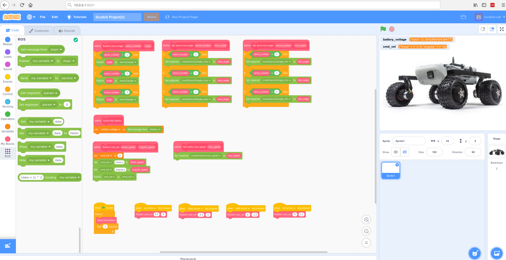
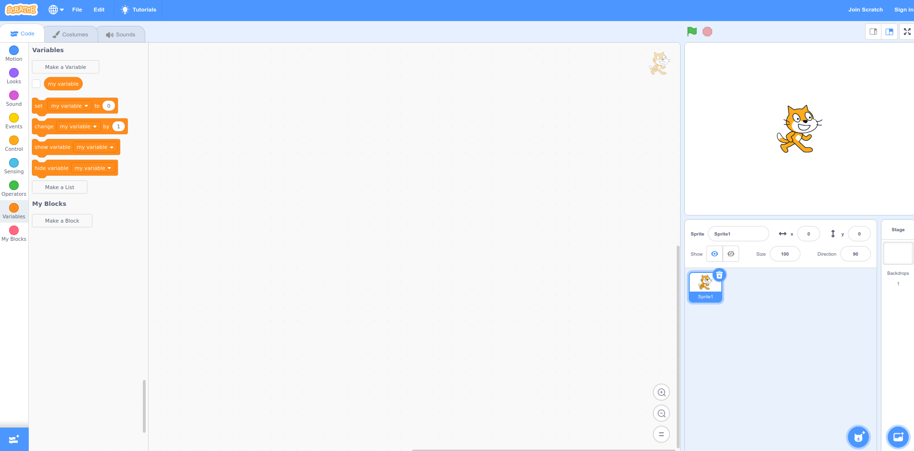

# Scratch 3.0

Author: Piotr Szlachcic `szlachcic@turtlerover.pl`  

## Introduction

We finally did it! Here's the long awaited Scratch integration tutorial for LeoOS. From now on you will be able to program your Rover via a  block-based graphical user interface and it's as easy as it looks like ;-\)




#### Scratch 3.0

Scratch is a block-based visual programming language dedicated to education. It's taught and used in schools and other edicational institutions as one of the best ways to begin your programming adventure. It doesn't need you to know anything about software to start and it's easy to edit, yet provides all the basic functionality of the Rover.

For more information about Scratch in general check this link: [https://scratch.mit.edu/about](https://scratch.mit.edu/about)

#### Scratch 3.0 GUI hosted locally

Normally you would use Scratch with an [online editor](https://scratch.mit.edu/projects/editor/?tutorial=getStarted), but for Leo Rover we'll integrate the editor in a different way. We'll build the Scratch editor locally and install a dedicated ROS extension to establish communication between Scratch editor and the Rover ROS layer.



## Installation and configuration

To make the installation process easier, we created a package of necessary dependencies, configuration files, and scripts. You just need to clone or download the repository from GitHub and run the script. With only a few commands everything will be done automatically.Please follow the instruction below.

#### Prerequisites

Open ssh session. It will be necessary to access a remote terminal on Leo Rover.



Establish the Internet connection.




It is necessary to establish the Internet connection as some dependencies need to be downloaded during the installation process.


#### Clone the repository

Clone [leo\_scratch repository](https://github.com/LeoRover/leo_scratch) from Leo Rover GitHub page.

```text
cd ~/
git clone https://github.com/LeoRover/leo_scratch.git
```

We recommend you clone it to the main directory, ****but doesn't matter where you decide to put it. If you put it somewhere else, pay attention as some of the next commands may require some changes.

#### [https://github.com/LeoRover/leo\_scratch](https://github.com/LeoRover/leo_scratch)

#### Run the script

Go into the cloned repository and run the script with root privileges \(sudo\). The default password to access root is `raspberry`. Installation may take up to 10 minutes.

```text
cd ~/leo_scratch
sudo bash run.sh
```


During the installation you will probably see some warnings about outdated dependencies. No worries, it is fine :\)


After the installation, it's needed to restart the service that was created. Type the command below in the terminal. More information about the services will come later in this tutorial.

```text
sudo systemctl restart scratch.service
```

#### Configuration

To establish proper communication between Scratch editor and the ROS layer, [rosapi](https://github.com/RobotWebTools/rosbridge_suite/tree/develop/rosapi) node is needed. It provides GUI service calls and allows for getting meta-information related to ROS \(like topic lists\) and interacting with the parameter server.


The last release of leo\_bringup package doesn't include rosapi node initialization. If your package is not up to date, follow **one** of the optional step.


**Option A \(recommended\): Upgrade package list**

```text
sudo apt update
sudo apt upgrade
```

**or Option B: Add rosapi node initialization to the main launch file**

The [rosapi](https://github.com/RobotWebTools/rosbridge_suite/tree/develop/rosapi) node is a part of the rosbridge\_server package installed on the Rover by default. You need to add a few commands to the main launch file to enable rosapi node.

Open  `/etc/ros/robot.launch` and add commands between &lt;launch&gt; and &lt;/launch&gt; tags. Try to add it as close to the bottom of the space as possible.

```text
<node name="rosapi" pkg="rosapi" type="rosapi_node">
    <param name="topics_glob" value="[*]" />
    <param name="services_glob" value="[*]" />
    <param name="params_glob" value="[*]" />
</node>
```

## Scratch GUI

Finally, the installation and configuration of the editor are done. To load the interface you need to open you web browser when connected to the Rover AP and type the IP address of the Rover together with the interface port number.

#### Default IP and port for Scratch editor below

```text
10.0.0.1:8601
```

You'll see something like that in your browser.



#### Add ROS extension

Click the extension icon in the right bottom corner and choose ROS extension. 

#### Connect the editor to the rosbridge server running on the Rover

Click on the icon to connect with rosbridge. Use the Rover address as the master IP \(10.0.0.1 when you are connected directly to the Rover access point\).



Now you're good to go and can start creating cool stuff with the Rover using Scratch. 

A sample project below will show you the basic functionality of the Rover described as blocks.


## Sample project: Drive the Rover with arrows

We created an example Scratch project to help you understand the language. You can simply load the project in your Scratch interface and control the Rover using keyboard arrows. 

Download the project file from [here](https://github.com/LeoRover/leo_scratch/blob/master/example/Scratch%20Project.sb3) \(to your PC\) and use the 'load' button in the editor.


## Troubleshooting the scratch.service

We created a service called `scratch.service` to launch Scratch editor hosting locally on the Rover. By default the service is enabled on every boot. Below you can find some helpful commands to check the servis status and control it.

#### Check the service status

```text
systemctl status scratch.service
```

#### Stop the service

```text
sudo systemctl stop scratch.service
```

#### Start the service

```text
sudo systemctl start scratch.service
```

#### Enable the service to start every time system is booting \(by default\)

```text
sudo systemctl enable scratch.service
```

#### Disable the service to start every time system is booting

```text
sudo systemctl disable scratch.service
```

#### Restart the service

```text
sudo systemctl restart scratch.service
```


If you find any problem with Scratch editor, start debugging by checking the service status first.


## Support

If you have any issue with the tutorial or the software, please open a thread in the [forum](https://forum.fictionlab.pl/) or write to me directly `szlachcic@turtlerover.pl`  

Piotr

