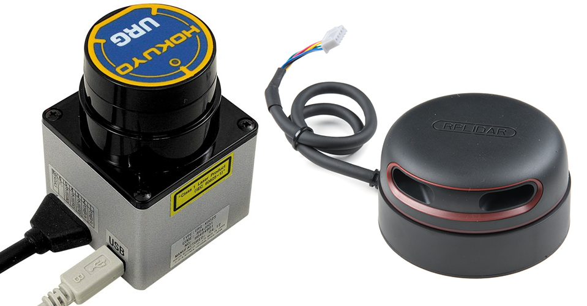

# LiDAR


2D LiDAR sensors are widely used in robotics for things such as indoor SLAM \([Simultaneous localization and mapping](https://en.wikipedia.org/wiki/Simultaneous_localization_and_mapping)\) or safety systems.

This tutorial will guide you through the process of connecting a LiDAR sensor to your Rover and integrating it with the system. We will present the complete instructions on Hokuyo URG-04LX and RPLIDAR A2M8 examples.




The steps for RPLIDAR are not complete and were not tested yet.


The steps might slightly differ for other LiDAR sensors but should be essentially similar.

After completing this tutorial, you should be able to visualize the model and data from the sensor like in the image below.


## Mounting and wiring the sensor 


When mounting the sensor, you should be particularly ****careful not to obstruct the field of view by other parts of the Rover.


We developed 3D printable models of parts that allow mounting the aforementioned sensors to the mounting plate located at the top of the robot. The files are listed here:



The sensor can be connected to the robot's main computer via the mounting plate USB socket. 

As for the power supply, you will have to provide additional connection from robot's battery to the sensor through a 5V DC converter \(if the sensor is not powered via the USB socket\).

The mounted sensor should look similar to this:







TODO



## Integrating the sensor with the system

The first thing you can do is to make sure your device has the correct permissions and is available at the fixed path on your system. To do this, you can add the following rule to the`udev` service:




```text
KERNEL=="ttyACM*", ATTRS{idVendor}=="15d1", MODE="0666", GROUP="dialout", SYMLINK+="lidar"
```





```
KERNEL=="ttyUSB*", ATTRS{idVendor}=="10c4", ATTRS{idProduct}=="ea60", MODE="0666", GROUP="dialout", SYMLINK+="lidar"
```




Paste these lines to `/etc/udev/rules.d/lidar.rules` file and reload `udev` rules by typing:

```bash
sudo udevadm control --reload-rules && sudo udevadm trigger
```

Your device should now be available at the `/dev/lidar` path.

We want the sensor functionality to be available in the ROS ecosystem, so you should install a ROS package that provides a node for the sensor you are trying to integrate.



```bash
sudo apt install ros-kinetic-urg-node
```



```bash
sudo apt install ros-kinetic-rplidar-ros
```



Now, create a launch file that would start the node with a fitting configuration.




```markup
<launch>
  <node name="urg_node" pkg="urg_node" type="urg_node" output="log">
    <param name="port" value="/dev/lidar"/>
    <param name="frame_id" value="laser_frame"/>
    <param name="calibrate_time" value="true"/>
  </node>
</launch>
```





```markup
<launch>
  <node name="rplidar_node" pkg="rplidar_ros" type="rplidarNode" output="screen">
    <param name="serial_port" value="/dev/lidar"/>
    <param name="frame_id" value="laser_frame"/>
  </node>
</launch>
```




Include your launch file in the `robot.launch` file, so that your node will start at boot.


```markup
<include file="/etc/ros/laser.launch"/>
```


Your robot should be aware of where the sensor is located and what space it occupies. You can ensure it does that by creating a URDF model of the sensor.




```markup
<?xml version="1.0"?>
<robot>

  <link name="hokuyo_link">
    <visual>
      <origin xyz="0 0 0.003"/>
      <geometry>
        <box size="0.079 0.05 0.006"/>
      </geometry>
      <material name="support">
        <color rgba="0.5 0.5 0.5 1.0"/>
      </material>
    </visual>
    <visual>
      <origin xyz="0 0 0.041"/>
      <geometry>
        <box size="0.05 0.05 0.07"/>
      </geometry>
      <material name="lidar">
        <color rgba="1.0 0.0 0.0 0.7"/>
      </material>
    </visual>
    <collision>
      <origin xyz="0 0 0.003"/>
      <geometry>
        <box size="0.079 0.05 0.006"/>
      </geometry>
    </collision>
    <collision>
      <origin xyz="0 0 0.038"/>
      <geometry>
        <box size="0.05 0.05 0.07"/>
      </geometry>
    </collision>
  </link>

  <joint name="hokuyo_joint" type="fixed">
    <origin xyz="0.08 0 0"/>
    <parent link="base_link"/>
    <child link="hokuyo_link"/>
  </joint>

  <link name="laser_frame"/>

  <joint name="laser_joint" type="fixed">
    <origin xyz="0 0 0.064"/>
    <parent link="hokuyo_link"/>
    <child link="laser_frame"/>
  </joint>

</robot>
```





```
TODO
```




and including it in the description that is uploaded at boot.


```markup
<xacro:include filename="/etc/ros/urdf/laser.urdf.xacro"/> 
```



You can experiment with the URDF file and create a more representative model of the sensor by adding more visual and collision tags or by including meshes in STL or COLLADA format.


The last step is to either reboot the robot or restart the `leo` service.

```bash
sudo systemctl restart leo
```

## Reading and visualizing the data

The robot should now publish the [LaserScan messages](http://docs.ros.org/api/sensor_msgs/html/msg/LaserScan.html) on the `/scan` topic. You can check the raw data that it sends by typing:

```bash
rostopic echo /scan
```

If you have ROS installed on your computer, you can get a more graphical representation of the data with RViz. If you don't have ROS, you can follow this guide:



Before starting RViz, make sure you completed the `Connecting other computer to ROS network` section of `ROS Development` tutorial:



Now, open RViz by typing `rviz` in the console or, if you have the `leo_description` package installed, type:

```bash
roslaunch leo_description rviz.launch
```

This will start RViz with visualization of the current robot model.

On the `Displays` panel click `Add` -&gt; `By topic` and search for the `/scan` topic. Choose the `LaserScan` display and click `Ok`.  You should now be able to see the data from the sensor visualized as points in 3D space. 

To put the points into the camera image, you can also add the`Camera` display \(be sure to check `compressed` as the Transport Hint\). Here's an example end result:



